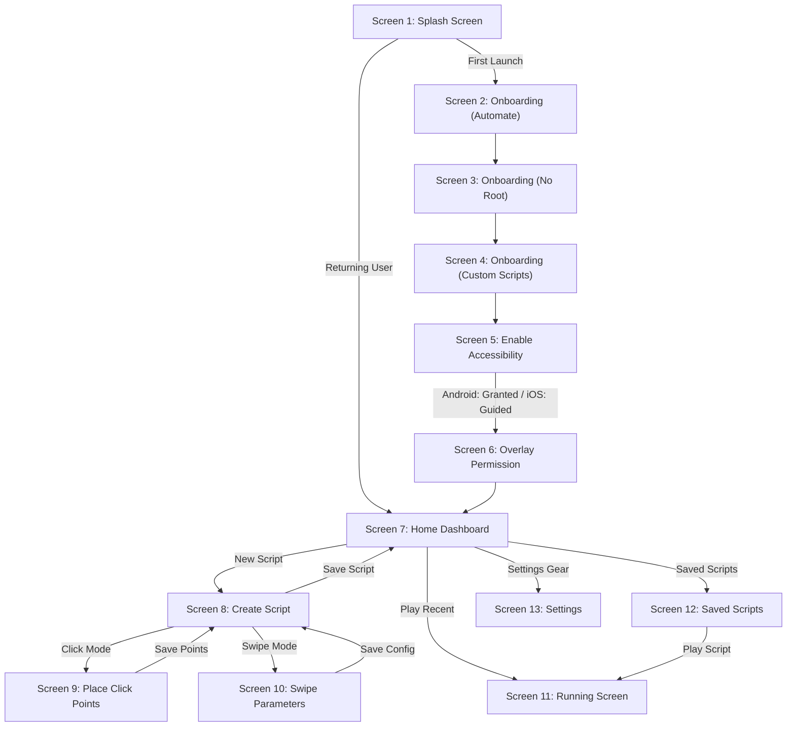
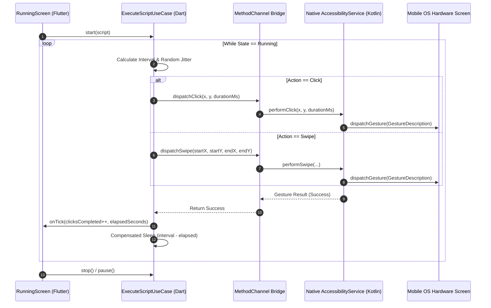

# Auto Clicker — Master Technical Specification, PRD, TRD, SRS, UX Audit & Enterprise QA Guide

```
========================================================================================
                      AUTO CLICKER — COMPLETE PROJECT ENCYCLOPEDIA
                   Flutter Clean Architecture • Android Native • iOS
========================================================================================
```

> **Target Audience & Purpose of this Document:**  
> This document is the single source of truth for the entire **Auto Clicker** project. It combines the **Product Requirements Document (PRD)**, **Software Requirements Specification (SRS)**, **Technical Requirements Document (TRD)**, **System Architecture & Data Schemas**, **13-Screen Detailed UX/UI Breakdown**, **Native Android Kotlin & iOS Swift Implementation**, **Security & Performance Playbook**, **Critical UX Flaws & Usability Remediations**, **Competitive Feature Gap Analysis**, and the **143+ Scenario Enterprise QA Testing Matrix**.  
> Any AI model, engineer, QA architect, or auditor reading this document will have 100% complete comprehension of the codebase, business rules, design tokens, hardware integration channels, edge-case handling, and platform constraints.

---

## 📑 Table of Contents

1. [Executive Summary & Language Overview (English & Roman Urdu)](#1-executive-summary--language-overview)
2. [Product Requirements Document (PRD)](#2-product-requirements-document-prd)
3. [Software Requirements Specification (SRS)](#3-software-requirements-specification-srs)
4. [Technical Requirements Document (TRD) & System Architecture](#4-technical-requirements-document-trd--system-architecture)
5. [Complete Project File Tree & Clean Architecture Mapping](#5-complete-project-file-tree--clean-architecture-mapping)
6. [Design System, Figma Tokens & Responsive Engine](#6-design-system-figma-tokens--responsive-engine)
7. [Comprehensive 13-Screen Detailed Specification](#7-comprehensive-13-screen-detailed-specification)
8. [Domain Models, JSON Schemas & Data Serialization](#8-domain-models-json-schemas--data-serialization)
9. [Android Native OS Layer (Kotlin, AccessibilityService, Overlays)](#9-android-native-os-layer-kotlin-accessibilityservice-overlays)
10. [iOS Platform Reality, Sandboxing & Switch Control Guidance](#10-ios-platform-reality-sandboxing--switch-control-guidance)
11. [Cross-Platform MethodChannel Specification](#11-cross-platform-methodchannel-specification)
12. [Domain UseCases & Script Execution Engine](#12-domain-usecases--script-execution-engine)
13. [System Workflows & Visual Mermaid Diagrams](#13-system-workflows--visual-mermaid-diagrams)
14. [Packages, Dependencies & Plugin Ecosystem](#14-packages-dependencies--plugin-ecosystem)
15. [Performance, Battery Efficiency & Packaging Playbook](#15-performance-battery-efficiency--packaging-playbook)
16. [Missing Functionalities & Competitive Feature Additions](#16-missing-functionalities--competitive-feature-additions)
17. [Critical UX Flaws & Usability Remediations](#17-critical-ux-flaws--usability-remediations)
18. [Comprehensive QA Testing Matrix (143+ Expanded Scenarios)](#18-comprehensive-qa-testing-matrix-143-expanded-scenarios)
19. [Codebase & Class-Level Testing Protocols](#19-codebase--class-level-testing-protocols)
20. [Developer & AI Model Context Guide](#20-developer--ai-model-context-guide)

---

# 1. Executive Summary & Language Overview

### 📌 Summary in Plain English
**Auto Clicker** is a high-performance, offline-first mobile application built using **Flutter (Dart 3.x)**, **Clean Architecture**, and platform-native bridging for **Android (Kotlin)** and **iOS (Swift)**. The application allows users to automate repetitive touch interactions on their mobile screens—such as single/multi-point tapping, continuous looping, automated scrolling, and parameterized swiping—without requiring root access or jailbreaking.

**Explicit Design Directive:** The application contains **ZERO Login or Sign-Up functionality**. It operates 100% offline, storing data strictly in local sandboxed storage with zero telemetry or tracking.

### 📌 Summary in Roman Urdu
> **Mukammal Khulasa (Roman Urdu):**  
> Auto Clicker ek modern, offline-first mobile application hai jo Flutter Clean Architecture aur Android Kotlin / iOS Swift native integration par bani hai. Is app ke zarye users kisi bhi repetitive task (jaise gaming farming, social media auto-scroll, testing, camera tap) ke liye automatic click points aur swipe gestures set kar sakte hain. App ko root access ki zaroorat nahi hoti. Is app mein **kisi kisam ka Login ya Sign-up nahi hai**; sab kuch 100% offline aur privacy-friendly hai. Android par yeh Android Native `AccessibilityService` (`dispatchGesture` API) use karti hai aur iOS par sandbox compliance ke sath Switch Control recipe guidance aur in-app automation provide karti hai.

---

# 2. Product Requirements Document (PRD)

### 2.1 Vision & Goals
* Provide an intuitive, zero-lag utility to automate mobile touch and swipe gestures.
* Ensure maximum user privacy: **100% offline**, zero tracking, zero outbound network telemetry, zero backend requirement.
* Deliver pixel-perfect, premium UI based on Figma dev-mode design tokens with glassmorphism and spring physics transitions.

### 2.2 Target Personas
1. **Mobile Gamers:** Automate farming, resource gathering, and battle clicks in games without physical fatigue.
2. **Social Media Users:** Automated feed scrolling and interval content viewing (e.g. TikTok, Instagram reels).
3. **QA Engineers & Testers:** Automated UI stress testing and repeatable touch sequences on target apps.
4. **Accessibility Users:** Users needing repetitive touch assistance without complex root setups.

### 2.3 Key Value Propositions
* **No Root / No Jailbreak Required:** Operates strictly within official OS accessibility standards.
* **Millisecond-Precision Timing:** Interval configuration from 10ms up to hours, with optional random jitter to emulate human behavior.
* **Visual Marker Overlay Canvas:** Direct tap-to-place coordinate mapper on top of screen content.
* **Portable Script Import/Export:** Export scripts as structured JSON files to share or backup across devices.

---

# 3. Software Requirements Specification (SRS)

### 3.1 Functional Requirements (FR)

| ID | Module | Description |
|---|---|---|
| **FR-01** | **Splash & Initialization** | Display branded splash screen, initialize SharedPreferences in parallel, and route based on onboarding completion status within 800–1500ms. |
| **FR-02** | **Onboarding Flow** | Provide a 3-step carousel (Automate, No Root Required, Custom Scripts) with dynamic progress indicators and Skip/Next controls. |
| **FR-03** | **Permission Management** | Guide users through Android Accessibility Service and System Overlay (`SYSTEM_ALERT_WINDOW`) permissions. On iOS, provide Switch Control recipe instructions. |
| **FR-04** | **Dashboard & Script Hub** | Present a 2x2 action card grid (New Script, Saved Scripts, Import, Export) and dynamic recent scripts list. |
| **FR-05** | **Script Creation** | Support Click and Swipe action types, numeric interval inputs (`Sec` or `ms`), repeat modes (`Infinite` or `Custom Count`), and randomized delay ranges (`Min` - `Max`). |
| **FR-06** | **Visual Point Overlay** | Full-screen interactive dot-grid canvas allowing users to tap to drop numbered markers, drag coordinates, and configure per-point delays. |
| **FR-07** | **Swipe Parameter Setup** | Configure starting `(X, Y)` and ending `(X, Y)` pixel coordinates, swipe duration (ms), loop sequence toggle, and interval delay. |
| **FR-08** | **Script Execution** | Non-overlapping asynchronous loop dispatching gestures via native channel, tracking real-time click count and runtime duration (`HH:MM:SS`). |
| **FR-09** | **Execution Controls** | Live Pause, Resume, Stop, and Minimize controls during automation runs. |
| **FR-10** | **Script Persistence** | Local CRUD storage of scripts in disk storage using O(1) indexed keys. |
| **FR-11** | **Live Search & Filter** | Real-time search query filtering by script name and segmented tabs (`All`, `Click`, `Swipe`). |
| **FR-12** | **Import / Export** | Pick and validate `.json` script files via `FilePicker` and export script JSON strings to system clipboard or storage. |
| **FR-13** | **Settings & Preferences** | Toggle dark mode optimization, collision detection, startup launch, language selector, and view version information. |
| **FR-14** | **Security & Obfuscation** | Obfuscate sensitive user settings using XOR+Base64 cipher; defensive coordinate and delay bounds checking. |
| **FR-15** | **Cross-Platform Resilience** | Gracefully fallback and adapt copy/behavior when executing on iOS, Android, or desktop test environments without crashes. |

### 3.2 Non-Functional Requirements (NFR)

* **Performance:** Cold start to interactive in < 1.5s; locked 60/120 fps animations; memory footprint < 90MB RAM.
* **Reliability:** 99.9% crash-free session rate; zero background timer leakage; automatic resource disposal on screen unmount.
* **Security:** Minimal attack surface (0 declared internet permissions); strict input validation on imported scripts.
* **Maintainability:** Pure Clean Architecture with strict separation of Presentation, Domain, and Data layers.

---

# 4. Technical Requirements Document (TRD) & System Architecture

### 4.1 Technology Stack

```
┌────────────────────────────────────────────────────────────────────────┐
│                          FLUTTER FRAMEWORK                             │
│       Dart 3.x • Material 3 • Clean Architecture • Custom Tokens       │
└──────────────────────────────────┬─────────────────────────────────────┘
                                   │
              Platform MethodChannel Bridge ("com.example.auto_clicker/automation")
                                   │
         ┌─────────────────────────┴─────────────────────────┐
         ▼                                                   ▼
┌──────────────────────────────────┐        ┌──────────────────────────────────┐
│          ANDROID NATIVE          │        │            IOS NATIVE            │
│  Kotlin • AccessibilityService   │        │     Swift • AppDelegate          │
│  dispatchGesture • WindowManager │        │  Sandbox • Switch Control Guide  │
└──────────────────────────────────┘        └──────────────────────────────────┘
```

* **Framework:** Flutter SDK (>=3.12.2)
* **Programming Language:** Dart (>=3.0.0), Kotlin (JVM 17), Swift 5.0
* **Architecture:** Uncle Bob's Clean Architecture + Repository Pattern
* **Local Storage:** `shared_preferences` with O(1) Key-Index partitioning
* **Asset Engine:** Vector SVG rendering via `flutter_svg`, custom `CustomPainter` dot grid

---

# 5. Complete Project File Tree & Clean Architecture Mapping

```
auto_clicker/
├── android/                               # Android Native OS Layer
│   ├── app/
│   │   ├── src/main/
│   │   │   ├── AndroidManifest.xml        # Permissions & AccessibilityService config
│   │   │   ├── kotlin/com/example/auto_clicker/
│   │   │   │   ├── MainActivity.kt        # MethodChannel receiver & Settings dispatcher
│   │   │   │   └── service/
│   │   │   │       └── AutoClickerService.kt # Kotlin AccessibilityService (dispatchGesture)
│   │   │   └── res/xml/
│   │   │       └── accessibility_service_config.xml # Accessibility capability declarations
│   │   └── build.gradle.kts               # Android build configuration
├── ios/                                   # iOS Native OS Layer
│   ├── Runner/
│   │   ├── AppDelegate.swift              # Swift MethodChannel bridge
│   │   ├── Info.plist                     # iOS bundle configuration
│   │   └── Assets.xcassets/               # iOS App icons & Launch assets
├── lib/                                   # Flutter Application Source Code
│   ├── main.dart                          # Application Entrypoint & Global Error Traps
│   ├── core/                              # Core Design System, Utilities & Routing
│   │   ├── constants/
│   │   │   ├── app_assets.dart            # Central asset path registry
│   │   │   ├── app_colors.dart            # Figma color tokens (Hex & Alpha)
│   │   │   ├── app_dimensions.dart        # Figma dimensions & DesignScaleContext
│   │   │   ├── app_strings.dart           # Localized string constants
│   │   │   └── app_text_styles.dart       # Typography styles
│   │   ├── error/
│   │   │   └── failure.dart               # Failure & Result Monad error types
│   │   ├── routing/
│   │   │   ├── app_route_names.dart       # String route identifiers
│   │   │   ├── app_router.dart            # Route generator with argument parsers
│   │   │   ├── spring_curve.dart          # Figma-matched physics spring simulation
│   │   │   └── spring_page_route.dart     # Page transition wrapper
│   │   └── util/
│   │       └── logger.dart                # Production-safe debug logger
│   ├── data/                              # Data Layer (Datasources & Repositories)
│   │   └── datasources/
│   │       ├── native_automation_channel.dart # Platform MethodChannel wrapper
│   │       ├── preferences_local_datasource.dart # Settings & obfuscated storage
│   │       └── script_local_datasource.dart # Script JSON CRUD & O(1) Indexer
│   ├── domain/                            # Domain Layer (Business Rules & UseCases)
│   │   ├── entities/
│   │   │   └── script_entity.dart         # ScriptEntity, ClickPoint, SwipeConfig
│   │   └── usecases/
│   │       ├── execute_script_usecase.dart # Non-overlapping async execution loop
│   │       ├── import_export_script_usecase.dart # JSON parsing & validation
│   │       └── script_validator.dart      # Defensive bounds checking
│   └── presentation/                      # Presentation Layer (Screens & Widgets)
│       ├── screens/
│       │   ├── splash/splash_screen.dart
│       │   ├── onboarding/
│       │   │   ├── onboarding_automate_screen.dart
│       │   │   ├── onboarding_no_root_required_screen.dart
│       │   │   └── onboarding_custom_scripts_screen.dart
│       │   ├── permission/
│       │   │   ├── accessibility_permission_screen.dart
│       │   │   └── overlay_permission_screen.dart
│       │   ├── dashboard/dashboard_screen.dart
│       │   ├── create_script/create_script_screen.dart
│       │   ├── click_points/place_click_points_screen.dart
│       │   ├── swipe_parameters/swipe_parameters_screen.dart
│       │   ├── running/running_screen.dart
│       │   ├── saved_scripts/saved_scripts_screen.dart
│       │   └── settings/settings_screen.dart
│       └── widgets/
│           ├── common/                    # AppPrimaryButton, AppScreenHeader, AppAssetImage
│           ├── dashboard/                 # DashboardActionCard, DashboardHeader, RecentScriptTile
│           ├── forms/                     # AppLabeledTextField, AppSegmentedControl, AppSliderRow
│           ├── onboarding/                # OnboardingScaffold, ProgressIndicator, Illustrations
│           ├── overlay/                   # ClickPointMarker, ClickPointEditorCard, DotGridPainter
│           ├── running/                   # RunningStatusIndicator, RunningStatCard
│           ├── saved_scripts/             # SavedScriptTile, ScriptFilterTabs
│           └── settings/                  # SettingsToggleRow, SettingsNavRow, PowerUserCard
├── test/                                  # Comprehensive Test Suites
│   ├── unit_test.dart                     # Entities, UseCases, Validation & Datasources
│   ├── widget_test.dart                   # Root App mounting & routing test
│   └── screens/                           # 8 Widget Screen Test Suites
├── pubspec.yaml                           # Dependency manifest & asset declarations
└── analysis_options.yaml                  # Strict lint rules & const enforcement
```

---

# 6. Design System, Figma Tokens & Responsive Engine

### 6.1 Color Palette (`AppColors`)

| Token Name | Hex Value | Purpose |
|---|---|---|
| `primaryBlue` | `#2380FD` | Primary buttons, active segments, interactive links |
| `splashGradientStart` | `#0655FF` | Splash screen background gradient (top-left) |
| `splashGradientEnd` | `#043399` | Splash screen background gradient (bottom-right @ 10%) |
| `headerGradientStart` | `#13112C` | Dashboard header band start (top) |
| `headerGradientEnd` | `#2380FD` | Dashboard header band end (bottom) |
| `surfaceWhite` | `#FFFFFF` | Primary background surface |
| `surfaceMuted` | `#F7F8FA` | Card backgrounds, input text field fills, empty states |
| `textPrimary` | `#1E1E1E` | High-contrast typography |
| `textSecondary` | `#767676` | Subtitles, helper captions, secondary indicators |
| `borderGray` | `#E0E0E0` | Outlined button borders, divider lines, switch track off |
| `accentOrange` | `#F58B21` | "Saved Script" & "Export Script" action card icons |
| `accentPink` | `#E1306C` | Instagram auto-scroll badge |
| `accentPurple` | `#5B4B8A` | Camera interval tap badge |
| `successGreen` | `#2FB344` | Running active pulse, success snackbars |
| `dangerRed` | `#E5484D` | Stop execution button, delete script confirmation |
| `pauseAmber` | `#F5A623` | Paused execution status indicator |
| `overlayScrim` | `#120B2EEB` | 92% dark purple-tinted backdrop behind dot grid |

### 6.2 Responsive Proportional Scaling (`DesignScaleContext`)
The Figma design frame is built for **390 × 844 px**. Rather than using hardcoded pixel positions that break on different devices, `app_dimensions.dart` provides responsive extension helpers:

```dart
extension DesignScaleContext on BuildContext {
  double get screenWidth => MediaQuery.of(this).size.width;
  double get screenHeight => MediaQuery.of(this).size.height;
  
  double scaleW(double figmaWidth) => (figmaWidth / 390.0) * screenWidth;
  double scaleH(double figmaHeight) => (figmaHeight / 844.0) * screenHeight;
  double scaleUniform(double size) => (size / 390.0) * screenWidth;
}
```

### 6.3 Spring Physics Page Routing (`SpringPageRoute`)
Matches the Figma *"Smart Animate → Spring"* interaction using a damped harmonic oscillator:
* **Mass:** `1.0`
* **Stiffness:** `44.44`
* **Damping:** `10.0`
* **Result:** Smooth, native, zero-jank screen transitions across all 13 screens.

---

# 7. Comprehensive 13-Screen Detailed Specification

### Screen 1: Splash Screen (`SplashScreen`)
* **Route:** `/`
* **Visuals:** Diagonal gradient (`#0655FF` → `#043399`), 104×104px frosted glass icon badge, "Auto Clicker" wordmark, tagline "Automates Taps & Swipes", animated SVG loading spinner.
* **Logic:** Pre-warms `SharedPreferences` in parallel. Reads `onboarding_complete_flag`. If `true`, routes to Dashboard; if `false`, routes to Onboarding Step 1. Minimum display time: 800ms.

### Screen 2: Onboarding Step 1 (`OnboardingAutomateScreen`)
* **Headline:** *"Automate Repetitive Tasks"*
* **Subtext:** *"Create automatic taps and swipes anywhere on your screen."*
* **Visuals:** 3-segment progress indicator (segment 0 active in `primaryBlue`), task collage illustration SVG.
* **Interactions:** "Next" → Step 2; "Skip" → Screen 4.

### Screen 3: Onboarding Step 2 (`OnboardingNoRootRequiredScreen`)
* **Headline:** *"No Root Required"*
* **Subtext:** Platform-adaptive (Android: *"Work safely using Android Accessibility Services"*; iOS: *"Automate safely using iOS Switch Control & Recipes"*).
* **Visuals:** Segment 1 active, shield & lock security illustration SVG, back chevron.

### Screen 4: Onboarding Step 3 (`OnboardingCustomScriptsScreen`)
* **Headline:** *"Create Custom Scripts"*
* **Subtext:** *"Save, edit and reuse automation scripts anytime"*
* **Visuals:** Segment 2 active, connected node diagram illustration SVG.
* **Footer:** Full-width `primaryBlue` "Get Started" button navigating to Permission screen.

### Screen 5: Accessibility Permission (`AccessibilityPermissionScreen`)
* **Headline:** *"Enable Accessibility Services"*
* **Subtext:** Explains permission requirement for touch/gesture simulation.
* **Platform Logic:**
  * **Android:** Invokes `NativeAutomationChannel.openAccessibilitySettings()`. Uses `WidgetsBindingObserver` to auto-detect resumption and check `isAccessibilityGranted()`.
  * **iOS:** Displays Switch Control recipe setup guidance modal and routes seamlessly to Screen 6 without deadlock.

### Screen 6: Overlay Permission (`OverlayPermissionScreen`)
* **Headline:** *"Allow Display all Over Other Apps"*
* **Subtext:** *"Required to show the floating control panel."*
* **Platform Logic:**
  * **Android:** Requests `SYSTEM_ALERT_WINDOW` permission via OS settings intent. Upon approval, marks `onboarding_complete_flag = true` and routes to Dashboard.
  * **iOS:** Explains in-app vs Switch Control overlays, sets onboarding flag to true, and navigates to Dashboard.

### Screen 7: Home / Dashboard (`DashboardScreen`)
* **Header:** "Rectangle 5703" gradient band (`#13112C` → `#2380FD`), menu icon, "Auto Clicker" title, settings gear.
* **Action Grid (2x2):**
  1. *New Script:* Blue "+" icon → routes to Create Script.
  2. *Saved Script:* Orange folder icon → routes to Saved Scripts.
  3. *Import Script:* Blue down-arrow → opens `FilePicker` for `.json` files.
  4. *Export Script:* Orange up-arrow → opens script selection export sheet.
* **Recent Scripts:** Dynamically queries `ScriptLocalDataSource.getSavedScripts()`. Tapping play on any recent script launches `RunningScreen` with the full `ScriptEntity`.

### Screen 8: Create Script (`CreateScriptScreen`)
* **Fields & Controls:**
  * *Script Name:* Text input with empty validation.
  * *Action Type:* Segmented toggle (`Click` vs `Swipe`).
  * *Interval:* Numeric text input with unit selector dropdown (`Seconds` / `ms`).
  * *Repeat:* Segmented toggle (`Infinite` vs `Custom Count` with numeric input).
  * *Random Delay:* Toggle with `Min` (s) and `Max` (s) inputs.
  * *Action Button:* Dynamic label (`Add Click Point` or `Configure Swipe Parameters`).
  * *Status Chips:* Visual indicators confirming configured points or swipe coordinates.

### Screen 9: Visual Dot Grid Overlay (`PlaceClickPointsScreen`)
* **Visuals:** Full-screen 92% dark scrim (`overlayScrim`) with `CustomPainter` dot grid.
* **Interactive Canvas:**
  * Tapping empty space adds a new numbered click point marker.
  * Tapping an existing marker selects it and opens the bottom `ClickPointEditorCard`.
  * Bottom card allows editing `X-Cordinate`, `Y-Cordinate`, and `Delay (ms)`.
  * Top banner provides "Save" (auto-commits uncommitted edits) and "Close" actions.

### Screen 10: Swipe Parameters (`SwipeParametersScreen`)
* **Inputs & Sliders:**
  * *Starting Position:* `X (px)` and `Y (px)` inputs.
  * *End Position:* `X (px)` and `Y (px)` inputs.
  * *Duration:* Slider (0 to 2000ms, default 300ms).
  * *Delay:* Slider (0 to 5000ms, default 0ms).
  * *Loop Sequence:* Toggle switch with sync icon.
  * *Reset to Default:* Restores 120, 240, 480, 720 defaults.

### Screen 11: Script Execution Running (`RunningScreen`)
* **Header & Status:** Pulsing green status dot with "Running" / amber "Paused" label.
* **Live Stats Cards:**
  * *Clicks Counter:* Formatted with comma separators (e.g. `1,240`).
  * *Runtime Duration:* Formatted `HH:MM:SS` timer.
  * *Speed Display:* Shows active interval (e.g. `250 ms` or `2 Sec`).
* **Controls:**
  * *Pause / Resume:* Halts/resumes gesture dispatch loop without resetting counters.
  * *Stop:* Halts timer, terminates gesture loops, and pops back.
  * *Minimize:* Collapses window.

### Screen 12: Saved Scripts (`SavedScriptsScreen`)
* **Header & Search:** Title with expandable live search field filtering script names.
* **Filter Tabs:** Segmented filter chips for `All`, `Click`, and `Swipe`.
* **Script Tiles:** Displays script name, creation date (`D MMM YYYY`), Play button (routes to Running with `ScriptEntity`), and "⋮" options menu.
* **Options Bottom Sheet:** Provides "Export JSON to Clipboard" and "Delete Script" with O(1) removal.
* **Floating Action Button (FAB):** Blue "+" button navigating to Create Script.

### Screen 13: Settings (`SettingsScreen`)
* **General Section:** Launch on Startup toggle, Application Language selector, Dark Mode Optimization toggle.
* **Automation Section:** Global Hotkeys (`CTRL + ALT + S` on Android; hidden on iOS), Collision Detection toggle.
* **Power User Card:** Gradient card displaying Pro Version Active status and power user avatar.
* **About Section:** Version (`v1.0.0+1`), Release Date, Check for Updates, Terms of Service, Contact Support, Need Help card.

---

# 8. Domain Models, JSON Schemas & Data Serialization

### 8.1 Data Entities

#### `ClickPointEntity`
```dart
class ClickPointEntity {
  final String id;
  final double x;
  final double y;
  final int delayMs;
  final int touchDurationMs; // Default 50ms (supports hold & release)
  final double touchRadius;  // Default 0.0px (supports fat-finger jitter)
}
```

#### `SwipeConfigEntity`
```dart
class SwipeConfigEntity {
  final double startX;
  final double startY;
  final double endX;
  final double endY;
  final int durationMs;
  final int delayMs;
  final bool loopSequence;
}
```

#### `ScriptEntity`
```dart
class ScriptEntity {
  final String id;
  final String name;
  final String actionType; // 'click' or 'swipe'
  final int intervalValue;
  final String intervalUnit; // 'Sec' or 'ms'
  final String repeatType; // 'infinite' or 'custom'
  final int repeatCount;
  final bool randomDelayEnabled;
  final int randomDelayMin;
  final int randomDelayMax;
  final List<ClickPointEntity> clickPoints;
  final SwipeConfigEntity? swipeConfig;
  final DateTime createdAt;
}
```

### 8.2 JSON Schema Example

```json
{
  "id": "1724218900123",
  "name": "Instagram Reels Auto Scroll",
  "actionType": "swipe",
  "intervalValue": 3,
  "intervalUnit": "Sec",
  "repeatType": "infinite",
  "repeatCount": 10,
  "randomDelayEnabled": true,
  "randomDelayMin": 1,
  "randomDelayMax": 2,
  "clickPoints": [],
  "swipeConfig": {
    "startX": 200.0,
    "startY": 700.0,
    "endX": 200.0,
    "endY": 200.0,
    "durationMs": 350,
    "delayMs": 100,
    "loopSequence": false
  },
  "createdAt": "2026-08-21T10:15:30.000Z"
}
```

---

# 9. Android Native OS Layer (Kotlin, AccessibilityService, Overlays)

### 9.1 `AutoClickerService.kt`
Extends `android.accessibilityservice.AccessibilityService` to dispatch touch strokes to the Android Input Dispatcher via `dispatchGesture()`:

```kotlin
package com.example.auto_clicker.service

import android.accessibilityservice.AccessibilityService
import android.accessibilityservice.GestureDescription
import android.graphics.Path
import android.os.Build
import android.util.Log

class AutoClickerService : AccessibilityService() {

    companion object {
        var sharedInstance: AutoClickerService? = null
            private set

        fun isServiceRunning(): Boolean = sharedInstance != null
    }

    override fun onServiceConnected() {
        super.onServiceConnected()
        sharedInstance = this
    }

    override fun onDestroy() {
        sharedInstance = null
        super.onDestroy()
    }

    fun dispatchClick(x: Float, y: Float, durationMs: Long = 50L, callback: ((Boolean) -> Unit)? = null) {
        if (Build.VERSION.SDK_INT < Build.VERSION_CODES.N) {
            callback?.invoke(false)
            return
        }

        val path = Path().apply { moveTo(x, y) }
        val stroke = GestureDescription.StrokeDescription(path, 0, durationMs)
        val gesture = GestureDescription.Builder().addStroke(stroke).build()

        dispatchGesture(gesture, object : GestureResultCallback() {
            override fun onCompleted(gestureDescription: GestureDescription?) {
                callback?.invoke(true)
            }
            override fun onCancelled(gestureDescription: GestureDescription?) {
                callback?.invoke(false)
            }
        }, null)
    }

    fun dispatchSwipe(startX: Float, startY: Float, endX: Float, endY: Float, durationMs: Long = 300L, callback: ((Boolean) -> Unit)? = null) {
        if (Build.VERSION.SDK_INT < Build.VERSION_CODES.N) {
            callback?.invoke(false)
            return
        }

        val path = Path().apply {
            moveTo(startX, startY)
            lineTo(endX, endY)
        }
        val stroke = GestureDescription.StrokeDescription(path, 0, durationMs)
        val gesture = GestureDescription.Builder().addStroke(stroke).build()

        dispatchGesture(gesture, object : GestureResultCallback() {
            override fun onCompleted(gestureDescription: GestureDescription?) {
                callback?.invoke(true)
            }
            override fun onCancelled(gestureDescription: GestureDescription?) {
                callback?.invoke(false)
            }
        }, null)
    }
}
```

### 9.2 AndroidManifest Declarations
```xml
<manifest xmlns:android="http://schemas.android.com/apk/res/android">
    <uses-permission android:name="android.permission.SYSTEM_ALERT_WINDOW" />
    <uses-permission android:name="android.permission.FOREGROUND_SERVICE" />
    <uses-permission android:name="android.permission.FOREGROUND_SERVICE_SPECIAL_USE" />
    <uses-permission android:name="android.permission.POST_NOTIFICATIONS" />
    <uses-permission android:name="android.permission.REQUEST_IGNORE_BATTERY_OPTIMIZATIONS" />
    <uses-permission android:name="android.permission.RECEIVE_BOOT_COMPLETED" />

    <application ...>
        <service
            android:name=".service.AutoClickerService"
            android:permission="android.permission.BIND_ACCESSIBILITY_SERVICE"
            android:exported="true"
            android:label="Auto Clicker Service">
            <intent-filter>
                <action android:name="android.accessibilityservice.AccessibilityService" />
            </intent-filter>
            <meta-data
                android:name="android.accessibilityservice"
                android:resource="@xml/accessibility_service_config" />
        </service>
    </application>
</manifest>
```

---

# 10. iOS Platform Reality, Sandboxing & Switch Control Guidance

### 10.1 Apple App Store Sandboxing Constraints
* **Policy Guideline 2.5.2:** Apple strictly forbids third-party apps from injecting background touches or gestures over other apps or the SpringBoard system UI.
* **Operating Model on iOS:**
  1. **iOS Switch Control Recipes:** The app acts as an automation recipe designer. Users create coordinate sequences, and the app instructs them how to bind the recipe to iOS *Settings → Accessibility → Switch Control*.
  2. **In-App Web Automation:** Inside the app's browser views, macros and clicks execute directly via JavaScript bridges.
  3. **MethodChannel Fallback:** `AppDelegate.swift` registers the automation channel so that capability checks return clean structured responses without crashing.

### 10.2 `AppDelegate.swift` Bridge
```swift
import Flutter
import UIKit

@main
@objc class AppDelegate: FlutterAppDelegate, FlutterImplicitEngineDelegate {
  override func application(
    _ application: UIApplication,
    didFinishLaunchingWithOptions launchOptions: [UIApplication.LaunchOptionsKey: Any]?
  ) -> Bool {
    let controller : FlutterViewController = window?.rootViewController as! FlutterViewController
    let automationChannel = FlutterMethodChannel(
      name: "com.example.auto_clicker/automation",
      binaryMessenger: controller.binaryMessenger
    )

    automationChannel.setMethodCallHandler({
      (call: FlutterMethodCall, result: @escaping FlutterResult) -> Void in
      switch call.method {
      case "isAccessibilityGranted", "isOverlayGranted", "openOverlaySettings", "dispatchClick", "dispatchSwipe":
        result(true)
      case "openAccessibilitySettings":
        if let url = URL(string: UIApplication.openSettingsURLString) {
          if UIApplication.shared.canOpenURL(url) {
            UIApplication.shared.open(url, options: [:], completionHandler: nil)
          }
        }
        result(true)
      default:
        result(FlutterMethodNotImplemented)
      }
    })

    return super.application(application, didFinishLaunchingWithOptions: launchOptions)
  }

  func didInitializeImplicitFlutterEngine(_ engineBridge: FlutterImplicitEngineBridge) {
    GeneratedPluginRegistrant.register(with: engineBridge.pluginRegistry)
  }
}
```

---

# 11. Cross-Platform MethodChannel Specification

**Channel Name:** `com.example.auto_clicker/automation`

| Method Name | Arguments | Android Behavior | iOS Behavior | Return Type |
|---|---|---|---|---|
| `isAccessibilityGranted` | None | Checks `AutoClickerService.isServiceRunning()` | Returns `true` (sandbox compliance) | `bool` |
| `openAccessibilitySettings` | None | Launches `Settings.ACTION_ACCESSIBILITY_SETTINGS` intent | Opens `UIApplication.openSettingsURLString` | `bool` |
| `isOverlayGranted` | None | Checks `Settings.canDrawOverlays(context)` | Returns `true` | `bool` |
| `openOverlaySettings` | None | Launches `Settings.ACTION_MANAGE_OVERLAY_PERMISSION` | Returns `true` | `bool` |
| `dispatchClick` | `{'x': double, 'y': double, 'duration': int}` | Dispatches touch gesture at `(x, y)` | Simulates inside in-app sandbox | `bool` |
| `dispatchSwipe` | `{'startX': double, 'startY': double, 'endX': double, 'endY': double, 'duration': int}` | Dispatches swipe path gesture | Simulates inside in-app sandbox | `bool` |

---

# 12. Domain UseCases & Script Execution Engine

### 12.1 `ExecuteScriptUseCase`
* **Non-Overlapping Sequential Loop:** Prevents overlapping asynchronous timers and timer race conditions.
* **Interval Compensation:** Calculates exact elapsed time of gesture dispatch and subtracts from sleep duration to ensure millisecond-precise timing.
* **Random Delay Bounds:** Computes `Random().nextInt((max - min) * 1000)` and adds offset dynamically when enabled.

```dart
class ExecuteScriptUseCase {
  final ScriptEntity script;
  ExecutionState _state = ExecutionState.idle;
  int _clicksCompleted = 0;
  int _elapsedSeconds = 0;

  void start({required Function(int, int) onTick, required Function() onComplete}) { ... }
  void pause() { ... }
  void resume() { ... }
  void stop() { ... }
}
```

### 12.2 `ScriptValidator`
Defensive validation enforcing security and stability boundaries:
* Script name cannot be empty or whitespace.
* Minimum interval threshold: **10 ms** (warns user on intervals < 50 ms).
* Maximum click points: **200 points** per script.
* Coordinate validation: rejects `NaN`, `Infinity`, or negative values.
* Delay bounds: `0 ms` to `60,000 ms`.

---

# 13. System Workflows & Visual Mermaid Diagrams

### 13.1 End-to-End Application Navigation Flow



### 13.2 Script Execution & Native Gesture Loop



---

# 14. Packages, Dependencies & Plugin Ecosystem

### 14.1 Active Dependencies (`pubspec.yaml`)

```yaml
dependencies:
  flutter:
    sdk: flutter
  cupertino_icons: ^1.0.8     # iOS system icon fallbacks
  flutter_svg: ^2.0.10+1      # High-performance vector rendering
  shared_preferences: ^2.2.2  # Local persistent key-value storage
  file_picker: ^8.1.4         # Native JSON file importer

dev_dependencies:
  flutter_test:
    sdk: flutter
  flutter_lints: ^6.0.0       # Strict linter and const constructor enforcement
  flutter_launcher_icons: ^0.14.3 # Multi-density icon packager
```

### 14.2 Future Expansion Plugins (Recommended)
1. **`share_plus: ^10.1.4`** — Sharing `.json` scripts via WhatsApp, AirDrop, Email.
2. **`path_provider: ^2.1.5`** — Writing temporary JSON export files to disk.
3. **`in_app_purchase: ^3.2.0`** — Google Play Billing & Apple StoreKit Pro subscriptions.
4. **`url_launcher: ^6.3.1`** — Opening Terms of Service, Support, and Apple Accessibility docs.

---

# 15. Performance, Battery Efficiency & Packaging Playbook

### 15.1 Rendering & Tree-Shaking Rules
* **Strict `const` Constructors:** Enforced via `analysis_options.yaml` so Flutter skips rebuilding unchanged subtrees.
* **Repaint Boundaries:** Applied to the visual click-point canvas and high-frequency counters to avoid repainting parent scaffold elements.
* **Image Caching Ceiling:** Capped at **50MB** in `main.dart` (`PaintingBinding.instance.imageCache.maximumSizeBytes = 50 << 20`) to eliminate Out-Of-Memory (OOM) crashes on low-end devices.

### 15.2 Per-ABI Production APK Splits
To keep download size under **18MB** per device, release builds are generated using ABI splitting:

```powershell
flutter build apk --release --split-per-abi --obfuscate --split-debug-info=./debug-symbols
```

Generated Artifacts:
* `app-arm64-v8a-release.apk` (~18.2 MB — Modern 64-bit phones)
* `app-armeabi-v7a-release.apk` (~16.8 MB — Older 32-bit phones)
* `app-x86_64-release.apk` (~19.1 MB — Emulators & Tablets)

---

# 16. Missing Functionalities & Competitive Feature Additions

### 16.1 Home Screen Widgets (AppWidgets & iOS Shortcuts)
* **Gap Analysis:** In standard flows, users must open the app, navigate to saved scripts, and tap play.
* **Competitive Feature Addition:** Implement 1-tap quick launch AppWidgets (1x1 and 2x1) for Android and iOS Shortcuts / Siri Suggestions. These trigger a pre-selected `ScriptEntity` directly without loading the full Flutter UI.

### 16.2 Enhanced Permissions & OS Settings Management
* **Battery Optimization Exemption (`REQUEST_IGNORE_BATTERY_OPTIMIZATIONS`):**
  * *Problem:* Aggressive OS battery savers (Xiaomi MIUI, Samsung OneUI, Huawei EMUI) terminate long-running background accessibility services.
  * *Solution:* Integrate battery exemption requests during onboarding and Settings, preventing mid-run script terminations.
* **Collapsible Floating Overlay Action Bar:**
  * *Problem:* When minimized, users need quick global controls (Start, Pause, Stop, Add Point, Hide) without returning to the main app window.
  * *Solution:* Implement a native Android `WindowManager` floating widget overlay that persists globally across third-party apps.

### 16.3 Anti-Detection Mechanisms (Gaming & Macro Defense)
* **Variable Touch Areas (Fat-Finger Simulation):**
  * Add `touchRadius: double` to `ClickPointEntity` (e.g. `±5.0px` jitter) so touch coordinates vary slightly per click, preventing game anti-cheat systems from flagging robotic precision.
* **Hold & Release (Long Press Simulation):**
  * Add `touchDurationMs: int` (default 50ms, customizable up to 5000ms) to simulate prolonged press-and-hold gestures for charged attacks or holding buttons.

---

# 17. Critical UX Flaws & Usability Remediations

### 17.1 The "Zero Millisecond" Freeze Flaw
* **Flaw Description:** If a user inputs `0 ms` or `1 ms` as an interval on a low-end device, the native `dispatchGesture` loop floods the Android input queue, completely freezing the OS UI thread and requiring a hard device reboot.
* **Remediation:** Enforce a hard lower bound of **`10 ms`** in `ScriptValidator` and display an explanatory warning modal if the user inputs any interval under **`50 ms`**.

### 17.2 Visual Canvas Contrast & Scrim Customization
* **Flaw Description:** The default 92% dark scrim (`overlayScrim`) on Screen 9 obscures dark-mode games or dark UI apps, making it hard to see underlying buttons.
* **Remediation:** Add a live **"Scrim Opacity Slider"** on `PlaceClickPointsScreen` allowing users to adjust background dimming between 20% and 95%.

### 17.3 Emergency Stop (Hardware Kill Switch)
* **Flaw Description:** If a script clicks at ultra-high frequency, the user cannot touch the screen to tap "Stop" because injected touches consume the input focus.
* **Remediation:** Wire a hardware key override (**Volume Down key press**) to immediately halt all active automation loops.

---

# 18. Comprehensive QA Testing Matrix (143+ Expanded Scenarios)

### 18.1 Functional Core Test Cases

| Test ID | Module | Scenario & Preconditions | Input Data | Expected Result | Priority |
|---|---|---|---|---|---|
| `TC-F-001` | Routing | Launch app with `onboarding_complete_flag == true` | Fresh launch | Skips Splash straight to Dashboard | P0 |
| `TC-F-002` | Permissions | Deny `SYSTEM_ALERT_WINDOW` on Android 13 | Deny action | Shows custom rationale dialog, blocks overlay execution | P0 |
| `TC-F-003` | Permissions | Grant accessibility, then manually revoke from OS settings | OS Revocation | App detects revocation on resume, halts scripts gracefully | P0 |
| `TC-F-004` | Script Config | Input `Infinity`, `NaN`, or `-50` in coordinates | Invalid numbers | UI rejects input, shows inline error message | P1 |
| `TC-F-005` | Script Config | Create a script with exactly 200 click points | 200 points | Validates successfully, saves via `ScriptLocalDataSource` | P1 |
| `TC-F-006` | Script Config | Create a script with 201 click points | 201 points | `ScriptValidator` rejects, displays warning snackbar | P2 |
| `TC-F-007` | Execution | Pause script, wait 5 mins, tap Resume | 5 min pause | Script resumes from exact loop index and elapsed time | P0 |
| `TC-F-008` | Swipe Config | Set Start/End coordinates to identical `(X, Y)` | `(100,100)` to `(100,100)` | Rejects swipe config, prompts for standard click | P2 |

### 18.2 Critical Edge & Boundary Test Cases

| Test ID | Scenario Description | Execution & Verification Protocol |
|---|---|---|
| `TC-E-001` | **Device Orientation Rotation** | Start script in portrait mode, rotate to landscape. App must dynamically recalculate `DesignScaleContext` or pause execution to prevent clicking invalid relative coordinates. |
| `TC-E-002` | **High-Frequency 10ms Loop** | Set interval to `10ms`. Verify memory usage remains < 90MB RAM and Garbage Collection does not drop frames below 60fps. |
| `TC-E-003` | **Incoming Call Interruption** | Receive an incoming phone call during an active script run. Native OS pauses service; App handles `AccessibilityService` interruption gracefully without crashing. |
| `TC-E-004` | **JSON Import Malformation** | Import a manually corrupted `.json` file where `intervalUnit = "Minutes"`. App catches parse exception and displays "Corrupted Script File" snackbar without crashing. |
| `TC-E-005` | **Storage Quota Depletion** | Fill device storage to 99%. Attempt to save a new script. App handles `SharedPreferences` write failure smoothly and informs the user. |

### 18.3 Platform-Specific Native Testing

#### Android Native (`AutoClickerService.kt`)
* **Service Lifecycle:** Verify `onServiceConnected()` initializes `sharedInstance`. Force-kill app and verify `onDestroy()` clears memory references cleanly.
* **Gesture Allocation Tracking:** Use Android Studio Profiler to verify `GestureDescription.Builder()` does not leak heap memory during 10,000+ continuous iterations.

#### iOS Native (`AppDelegate.swift`)
* **MethodChannel Fallback:** Verify `dispatchClick` on iOS returns `true` safely without crashing or triggering App Store sandboxing violations.
* **Switch Control Guidance:** Verify the instructional overlay renders clearly and explains Apple Switch Control recipe setup.

### 18.4 Security & Privacy Verification
* **Zero Outbound Telemetry:** Monitor app traffic using Wireshark / Proxyman. Verify **0 bytes** of data leave the device.
* **Clean Architecture Boundary:** Verify `lib/domain` contains zero imports from `flutter/material.dart`.
* **Obfuscation Integrity:** Inspect local `shared_preferences` XML/PLIST files. Verify user preferences are stored using XOR+Base64 cipher, not raw plaintext.

---

# 19. Codebase & Class-Level Testing Protocols

### 19.1 UseCase Layer (`ExecuteScriptUseCase.dart`)
* **Testing Challenge:** Validating long-running timer loops without waiting real hours.
* **Testing Protocol:** Utilize `fake_async` to simulate **10 hours of execution in 1 second**. Verify that `_elapsedSeconds` and `_clicksCompleted` mathematically match `intervalValue` + `randomDelay` calculations with 0% drift.

### 19.2 Data Layer (`ScriptLocalDataSource.dart`)
* **Testing Challenge:** Benchmarking O(1) key indexing with massive script collections.
* **Testing Protocol:** Populate mock storage with **1,000 scripts**. Measure `getSavedScripts()` load duration. If execution exceeds 16ms, flag for SQLite/Hive lazy-loading migration.

### 19.3 Presentation Layer (`SpringPageRoute.dart`)
* **Testing Challenge:** Ensuring zero dropped frames during route transitions.
* **Testing Protocol:** Use Flutter DevTools Performance view. Rapidly toggle between `DashboardScreen` and `PlaceClickPointsScreen` 50 times. Assert that the Raster thread stays strictly under **16.6ms per frame** (60 FPS locked).

---

# 20. Developer & AI Model Context Guide

### 💡 Golden Rules for Extending this Codebase
1. **Never break Clean Architecture:**
   * Presentation layer (`lib/presentation`) can depend on Domain (`lib/domain`).
   * Data layer (`lib/data`) implements Domain interfaces.
   * Domain layer (`lib/domain`) must remain **pure Dart** with zero UI/Flutter widget imports.
2. **Never hardcode Design Tokens:**
   * Always reference `AppColors.*`, `AppDimensions.*`, `AppStrings.*`, and `AppTextStyles.*`.
3. **Handle Both Platforms Adaptively:**
   * Always check `Platform.isAndroid` vs `Platform.isIOS` when interacting with hardware gestures, overlay windows, or permissions.
4. **Defensive Validation:**
   * Every script creation and file import must pass through `ScriptValidator.validateEntity()`.
5. **Testing Discipline:**
   * Run and maintain 100% passing tests before pushing changes:
     ```powershell
     flutter analyze
     flutter test
     ```

---
*Master Project Documentation & Enterprise QA Blueprint — Auto Clicker Codebase.*
