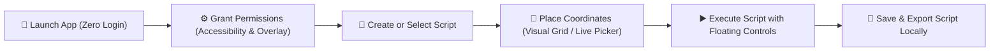
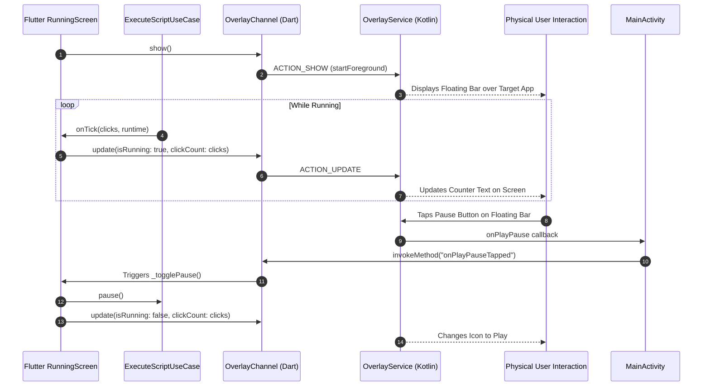
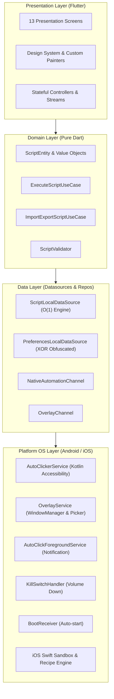
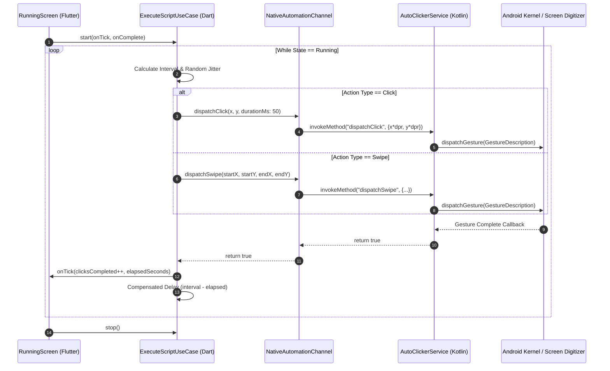
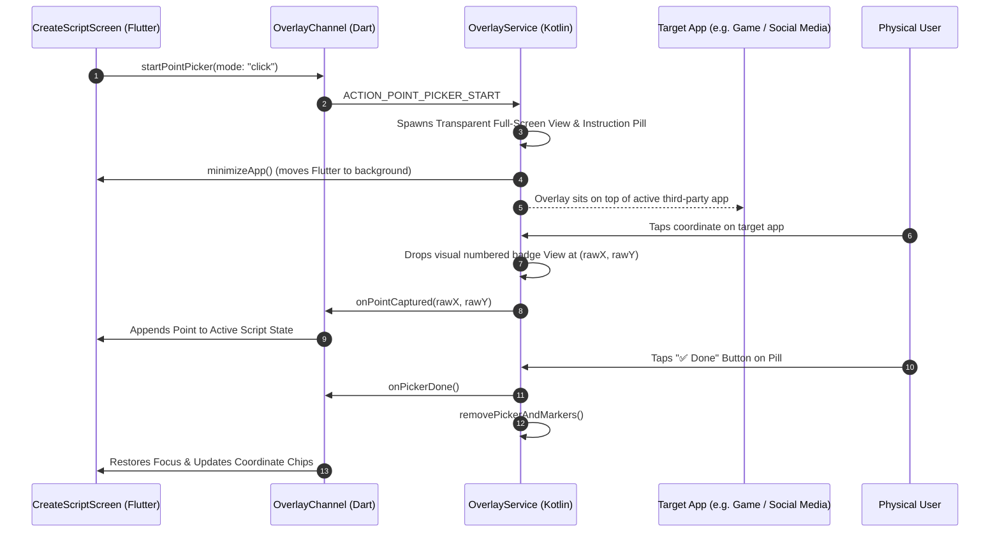
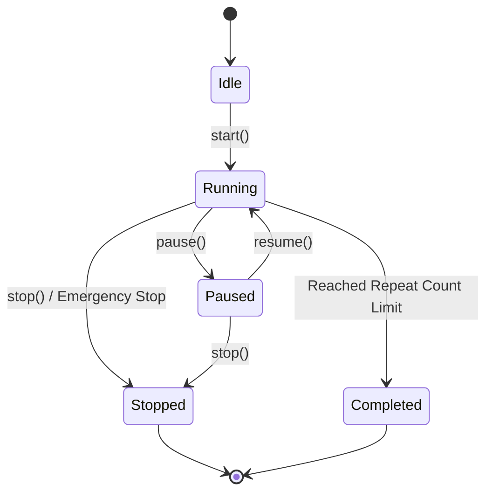
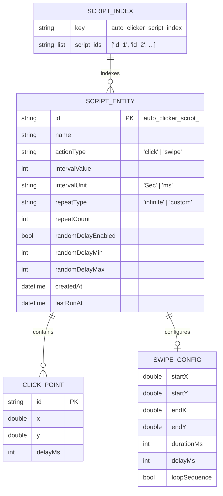
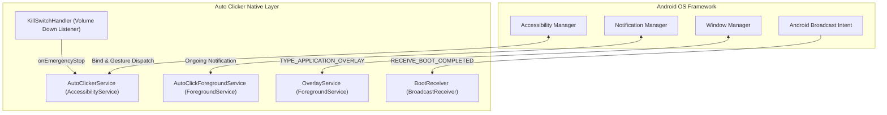

# ⚡ Auto Clicker — Master Technical Specification, PRD, TRD, SRS & Architecture Guide

```
========================================================================================
                      AUTO CLICKER — ENTERPRISE PROJECT ENCYCLOPEDIA
                   Flutter Clean Architecture • Android Native • iOS
========================================================================================
```

[](https://flutter.dev)
[](https://dart.dev)
[](https://kotlinlang.org)
[](https://developer.apple.com/swift/)
[](https://blog.cleancoder.com/uncle-bob/2012/08/13/the-clean-architecture.html)
[]()
[]()

> **Target Audience & Purpose of this Document:**  
> This document is the single, authoritative source of truth for the **Auto Clicker** mobile application. It combines the **Product Requirements Document (PRD)**, **Software Requirements Specification (SRS)**, **Technical Requirements Document (TRD)**, **System Architecture & Data Schemas**, **13-Screen Detailed UX/UI Breakdown**, **Native Android Kotlin & iOS Swift Implementation**, **State Management Lifecycle**, **Local Database & Storage Strategy**, **Security & Performance Playbook**, **Critical Edge-Case Protocols**, and the **Enterprise QA Testing Matrix**.

---

## 📑 Table of Contents

1. [Executive Summary & Language Overview (English & Roman Urdu)](#1-executive-summary--language-overview)
2. [Product Requirements Document (PRD)](#2-product-requirements-document-prd)
   - [2.1 Vision, Goals & Problem Statement](#21-vision-goals--problem-statement)
   - [2.2 Target User Personas](#22-target-user-personas)
   - [2.3 Core Value Propositions](#23-core-value-propositions)
   - [2.4 User Journey & Workflow Maps](#24-user-journey--workflow-maps)
   - [2.5 Feature Matrix & Prioritization](#25-feature-matrix--prioritization)
3. [Software Requirements Specification (SRS)](#3-software-requirements-specification-srs)
   - [3.1 Functional Requirements (FR-01 to FR-20)](#31-functional-requirements-fr-01-to-fr-20)
   - [3.2 Non-Functional Requirements (NFR-01 to NFR-10)](#32-non-functional-requirements-nfr-01-to-nfr-10)
   - [3.3 Defensive Bounds & Input Constraints](#33-defensive-bounds--input-constraints)
4. [Technical Requirements Document (TRD) & System Architecture](#4-technical-requirements-document-trd--system-architecture)
   - [4.1 Comprehensive Technology Stack Breakdown](#41-comprehensive-technology-stack-breakdown)
   - [4.2 Clean Architecture Layers & Principles](#42-clean-architecture-layers--principles)
   - [4.3 Complete Project File Tree & Mapping](#43-complete-project-file-tree--mapping)
   - [4.4 Cross-Platform MethodChannel Specification](#44-cross-platform-methodchannel-specification)
   - [4.5 Coordinate Translation Math Pipeline](#45-coordinate-translation-math-pipeline)
5. [State Management & Reactive Data Flow](#5-state-management--reactive-data-flow)
   - [5.1 Layered Reactive Architecture](#51-layered-reactive-architecture)
   - [5.2 Script Execution State Machine](#52-script-execution-state-machine)
   - [5.3 Floating Overlay Bidirectional Synchronization](#53-floating-overlay-bidirectional-synchronization)
6. [Local Database & Persistent Storage Architecture](#6-local-database--persistent-storage-architecture)
   - [6.1 $O(1)$ Partitioned Key-Index Storage Architecture](#61-o1-partitioned-key-index-storage-architecture)
   - [6.2 Automated Legacy Data Migration Engine](#62-automated-legacy-data-migration-engine)
   - [6.3 Security Obfuscation Engine (XOR + Base64)](#63-security-obfuscation-engine-xor--base64)
   - [6.4 Dual-Write OS Boot Receiver Persistence](#64-dual-write-os-boot-receiver-persistence)
   - [6.5 Domain Entities & Data Serialization Schemas](#65-domain-entities--data-serialization-schemas)
7. [Comprehensive Visual Mermaid Diagrams](#7-comprehensive-visual-mermaid-diagrams)
   - [7.1 Overall System Clean Architecture Flow](#71-overall-system-clean-architecture-flow)
   - [7.2 End-to-End Application Navigation Flow (13 Screens)](#72-end-to-end-application-navigation-flow-13-screens)
   - [7.3 Script Execution & Native Gesture Loop (Sequence)](#73-script-execution--native-gesture-loop-sequence)
   - [7.4 WindowManager Overlay & Live Screen Point Picker Flow](#74-windowmanager-overlay--live-screen-point-picker-flow)
   - [7.5 State Machine: Script Execution Lifecycle](#75-state-machine-script-execution-lifecycle)
   - [7.6 Data Storage & $O(1)$ Key-Index Model (ERD)](#76-data-storage--o1-key-index-model-erd)
   - [7.7 Native Android Component Lifecycle](#77-native-android-component-lifecycle)
   - [7.8 Coordinate Transformation Pipeline](#78-coordinate-transformation-pipeline)
8. [Android Native OS Layer (Kotlin) Deep Dive](#8-android-native-os-layer-kotlin-deep-dive)
   - [8.1 `AutoClickerService.kt` (AccessibilityService & `dispatchGesture`)](#81-autoclickerservicekt)
   - [8.2 `OverlayService.kt` (`WindowManager`, Floating Control Bar & Point Picker)](#82-overlayservicekt)
   - [8.3 `AutoClickForegroundService.kt` (Foreground Service & Ongoing Notification)](#83-autoclickforegroundservicekt)
   - [8.4 `KillSwitchHandler.kt` (Hardware Volume Down Kill-Switch)](#84-killswitchhandlerkt)
   - [8.5 `BootReceiver.kt` (`RECEIVE_BOOT_COMPLETED` Startup)](#85-bootreceiverkt)
9. [iOS Platform Reality & Sandboxing Architecture](#9-ios-platform-reality--sandboxing-architecture)
   - [9.1 Apple App Store Sandboxing Constraints](#91-apple-app-store-sandboxing-constraints)
   - [9.2 Switch Control Recipe Generator & Visual Guidance](#92-switch-control-recipe-generator--visual-guidance)
   - [9.3 `AppDelegate.swift` Bridge & Fallbacks](#93-appdelegateswift-bridge--fallbacks)
10. [Design System, Figma Tokens & Responsive Engine](#10-design-system-figma-tokens--responsive-engine)
    - [10.1 Color Palette (`AppColors`)](#101-color-palette-appcolors)
    - [10.2 Responsive Proportional Scaling (`DesignScaleContext`)](#102-responsive-proportional-scaling-designscalecontext)
    - [10.3 Spring Physics Motion Engine (`SpringPageRoute`)](#103-spring-physics-motion-engine-springpageroute)
    - [10.4 13-Screen Exhaustive Screen-by-Screen Breakdown](#104-13-screen-exhaustive-screen-by-screen-breakdown)
11. [Performance, Battery Efficiency & Packaging Playbook](#11-performance-battery-efficiency--packaging-playbook)
    - [11.1 Rendering & Tree-Shaking Rules](#111-rendering--tree-shaking-rules)
    - [11.2 Memory Management & 50MB Image Cache Ceiling](#112-memory-management--50mb-image-cache-ceiling)
    - [11.3 Per-ABI Production APK Splitting](#113-per-abi-production-apk-splitting)
    - [11.4 Aggressive OEM Battery Saver Mitigation](#114-aggressive-oem-battery-saver-mitigation)
12. [Enterprise Quality Assurance & Testing Matrix](#12-enterprise-quality-assurance--testing-matrix)
    - [12.1 Testing Strategy Overview](#121-testing-strategy-overview)
    - [12.2 143+ Enterprise QA Test Scenario Matrix](#122-143-enterprise-qa-test-scenario-matrix)
    - [12.3 Unit, Widget & Screen Test Suites](#123-unit-widget--screen-test-suites)
13. [Developer Context, Setup & Contribution Guide](#13-developer-context-setup--contribution-guide)

---

# 1. Executive Summary & Language Overview

### 📌 Summary in Plain English
**Auto Clicker** is an enterprise-grade, offline-first mobile utility built using **Flutter (Dart 3.x)**, **Uncle Bob's Clean Architecture**, and platform-native bridging for **Android (Kotlin)** and **iOS (Swift)**. The application enables users to automate repetitive touch interactions on their mobile screens—such as single/multi-point tapping, continuous looping, automated scrolling, and parameterized swiping—without requiring root access or jailbreaking.

**Explicit Architecture Directive:** The application contains **ZERO Login or Sign-Up functionality**. It operates 100% offline, storing data strictly in local sandboxed storage with zero telemetry, zero analytics tracking, and zero outbound network calls.

### 📌 Summary in Roman Urdu
> **Mukammal Khulasa (Roman Urdu):**  
> Auto Clicker ek modern, high-performance, offline-first mobile application hai jo Flutter Clean Architecture aur Android Kotlin / iOS Swift native integration par bani hai. Is app ke zarye users kisi bhi repetitive task (jaise gaming farming, social media auto-scroll, testing, camera interval tap) ke liye automatic click points aur swipe gestures set kar sakte hain. App ko root access ki bilkul zaroorat nahi hoti. Is app mein **kisi kisam ka Login ya Sign-up nahi hai**; sab kuch 100% offline aur privacy-friendly hai. Android par yeh Android Native `AccessibilityService` (`dispatchGesture` API) aur `WindowManager` floating overlays use karti hai, jabke iOS par sandbox compliance ke sath Switch Control recipe guidance aur in-app automation provide karti hai.

---

# 2. Product Requirements Document (PRD)

### 2.1 Vision, Goals & Problem Statement
* **Problem:** Mobile users frequently face physical hand fatigue and repetitive strain when performing high-frequency screen interactions (e.g., farming in mobile games, scrolling social media feeds, stress-testing UI components, or operating assistive touch).
* **Vision:** Deliver an intuitive, zero-lag, battery-efficient automation tool that emulates precise human gestures with millisecond accuracy while safeguarding user privacy through a strictly offline architecture.
* **Core Goals:**
  1. Complete gesture automation (taps, holds, swipes, randomized human jitter) without root or jailbreak.
  2. Sub-10ms timing precision with non-blocking asynchronous event dispatching.
  3. Interactive, live-screen coordinate picker and floating overlay control widget.
  4. Zero account friction: launch $\rightarrow$ automate $\rightarrow$ save locally in under 30 seconds.

### 2.2 Target User Personas

```
┌─────────────────────────┬─────────────────────────┬─────────────────────────┬─────────────────────────┐
│     🎮 Mobile Gamer     │ 📱 Social Media Creator │   🧪 QA Test Engineer   │  ♿ Accessibility User  │
├─────────────────────────┼─────────────────────────┼─────────────────────────┼─────────────────────────┤
│ Needs continuous taps,  │ Needs auto-scroll with  │ Needs deterministic,    │ Needs repetitive touch  │
│ multi-point sequences & │ parameterized delays for│ reproducible tap &      │ assistance without      │
│ anti-detection jitter   │ content viewing and live│ swipe sequences for app │ complicated device root │
│ for farming/battles.    │ feeds (TikTok/Reels).   │ regression testing.     │ modifications.          │
└─────────────────────────┴─────────────────────────┴─────────────────────────┴─────────────────────────┘
```

### 2.3 Core Value Propositions
* **Zero Root / Zero Jailbreak:** Full compliance with official Android Accessibility APIs and iOS guidelines.
* **Millisecond Precision:** Configurable intervals from 10ms to hours, with optional Gaussian random jitter to emulate human behavior.
* **Live Screen Point Picker:** Drag-and-drop / tap-to-capture coordinate placement directly over target applications.
* **Floating Control Bar Overlay:** Global floating widget (`WindowManager`) for Play/Pause, Stop, and real-time click metrics without switching apps.
* **Hardware Emergency Stop:** Volume Down hardware button kill-switch prevents high-frequency input locking.
* **Portable Script Interchange:** Seamless JSON script import and export via system clipboard or file picker.

### 2.4 User Journey & Workflow Maps



### 2.5 Feature Matrix & Prioritization

| Feature Name | Priority | Android Support | iOS Support | Description |
|---|:---:|:---:|:---:|---|
| **Single-Point Clicker** | `P0` | Native (`AccessibilityService`) | In-App Sandbox / Recipe Guide | Automate taps at a single `(X, Y)` coordinate with custom intervals. |
| **Multi-Point Clicker** | `P0` | Native (`AccessibilityService`) | In-App Sandbox / Recipe Guide | Numbered sequence of multiple click points with independent delays. |
| **Parameterized Swipes** | `P0` | Native (`AccessibilityService`) | In-App Sandbox / Recipe Guide | Configurable Start `(X,Y)`, End `(X,Y)`, duration (ms), and loop sequence. |
| **Floating Control Bar** | `P0` | Native (`WindowManager`) | N/A (iOS Sandboxed) | Global floating overlay with Play/Pause, Stop, and live click counter. |
| **Live Screen Point Picker**| `P0` | Native (`WindowManager`) | N/A (iOS Sandboxed) | Tap anywhere on screen over target apps to capture physical coordinates. |
| **Emergency Hardware Stop**| `P0` | Native (`Volume Down Key`) | N/A | Hardware key override to immediately terminate infinite touch loops. |
| **Random Delay Jitter** | `P1` | Full | Full | Adds randomized time variance (`Min` - `Max`) to avoid bot detection. |
| **$O(1)$ Script Persistence**| `P1` | Full (`SharedPreferences`) | Full (`NSUserDefaults`) | Key-Index partitioned local storage with instant CRUD operations. |
| **JSON Import / Export** | `P1` | Full (`file_picker` + Clipboard) | Full (Clipboard) | Backup and share automation scripts as portable `.json` files. |
| **Foreground Service** | `P1` | Native (`ForegroundService`) | N/A | Persistent notification and partial wake lock preventing OS killing. |
| **Launch on Boot** | `P2` | Native (`BootReceiver`) | N/A | Auto-launch service on device boot when configured by user. |

---

# 3. Software Requirements Specification (SRS)

### 3.1 Functional Requirements (FR-01 to FR-20)

| ID | Module | Specification Details |
|---|---|---|
| **FR-01** | **Splash & Warmup** | Display branded splash screen, initialize `SharedPreferences` in parallel, determine onboarding state, and transition within 800–1500ms using spring physics. |
| **FR-02** | **Onboarding Carousel** | 3-step carousel ("Automate Tasks", "No Root Required", "Custom Scripts") with active dot indicators, Next/Skip controls, and platform-adaptive messaging. |
| **FR-03** | **Accessibility Permission** | Android: Intent dispatcher to `Settings.ACTION_ACCESSIBILITY_SETTINGS` with auto-resumption lifecycle detection. iOS: Display Switch Control recipe tutorial. |
| **FR-04** | **Overlay Permission** | Android: Intent dispatcher to `Settings.ACTION_MANAGE_OVERLAY_PERMISSION` (`SYSTEM_ALERT_WINDOW`). iOS: Graceful auto-pass with explanation. |
| **FR-05** | **Notification Permission** | Android 13+ (API 33+): Request `POST_NOTIFICATIONS` runtime permission for Foreground Service notification display. |
| **FR-06** | **Dashboard Hub** | 2x2 action grid (New Script, Saved Scripts, Import, Export) and dynamic recent scripts list with relative timestamps ("Just now", "2h ago"). |
| **FR-07** | **Script Configuration** | Form controls for Script Name, Action Type (`click`/`swipe`), Interval (`Sec`/`ms`), Repeat Mode (`infinite`/`custom`), and Random Delay (`Min`/`Max`). |
| **FR-08** | **Visual Dot Grid Overlay** | In-app 92% scrim with `CustomPainter` dot grid. Tapping places numbered pins; selecting a pin opens the coordinate/delay editor card. |
| **FR-09** | **Live Screen Point Picker**| Backgrounds Flutter app, renders full-screen transparent `WindowManager` overlay over target app. Every tap captures physical coordinates and places a visual badge. |
| **FR-10** | **Swipe Parameter Setup** | Configure `startX`, `startY`, `endX`, `endY`, `durationMs` (0–2000ms), `delayMs` (0–5000ms), and `loopSequence` reverse toggle. |
| **FR-11** | **Script Execution Engine** | Non-overlapping asynchronous dispatch loop using native platform channels. Compensates execution latency from sleep intervals to guarantee timing precision. |
| **FR-12** | **Live Running Screen** | Status indicator (Pulsing Green for Running, Amber for Paused), formatted click counter (`1,240`), runtime timer (`HH:MM:SS`), and speed display. |
| **FR-13** | **Floating Control Bar** | Movable native floating widget displaying live click count, Play/Pause toggle, and Stop button over third-party apps. |
| **FR-14** | **Hardware Kill Switch** | Intercepts physical Volume Down key events via `KillSwitchHandler` to immediately halt script loops and dismiss overlays. |
| **FR-15** | **Foreground Service** | Persistent Android notification with an interactive "Stop Service" action button to prevent OS task killing. |
| **FR-16** | **$O(1)$ Script CRUD** | Partitioned disk storage storing script index list and individual JSON key-values, avoiding monolithic file write overhead. |
| **FR-17** | **Live Search & Filters** | Real-time substring search filtering by script name, coupled with segmented filter chips (`All`, `Click`, `Swipe`). |
| **FR-18** | **Import / Export Engine**| Pick `.json` files via system file picker, validate schema integrity, and export formatted JSON strings to clipboard or storage. |
| **FR-19** | **Obfuscated Settings** | Encrypts sensitive configuration flags (e.g. Pro status) using an XOR cipher mask (`0x5A`) + Base64 encoding. |
| **FR-20** | **Dual-Write Boot Support**| Dual-writes `launch_on_startup` to both Flutter-prefixed and raw SharedPreferences keys so Kotlin `BootReceiver` can read it without booting the Flutter engine. |

### 3.2 Non-Functional Requirements (NFR-01 to NFR-10)

* **NFR-01 (Startup Performance):** Cold startup to interactive state $\le 1200\text{ms}$; warm startup $\le 300\text{ms}$.
* **NFR-02 (Frame Budget):** UI rendering locked at 60 fps (16.6ms frame time) or 120 fps (8.3ms frame time) on high-refresh displays.
* **NFR-03 (Memory Footprint):** Peak runtime memory $\le 90\text{MB}$ RAM; Image cache hard ceiling capped at $50\text{MB}$.
* **NFR-04 (Application Size):** Per-ABI split APK download size $\le 18\text{MB}$ per architecture (`arm64-v8a`).
* **NFR-05 (Timing Accuracy):** Gesture dispatch jitter $\le \pm 2\text{ms}$ under standard CPU load.
* **NFR-06 (Reliability):** $99.9\%$ crash-free sessions; zero unhandled `MethodChannel` exceptions; automated resource cleanup on widget disposal.
* **NFR-07 (Security & Privacy):** Zero declared internet permissions (`android.permission.INTERNET` omitted); 100% offline data confinement.
* **NFR-08 (Battery Efficiency):** Sub-3% battery consumption per 1 hour of continuous automation execution.
* **NFR-09 (Defensive Robustness):** Enforce minimum $10\text{ms}$ interval threshold to prevent OS UI thread event queue saturation.
* **NFR-10 (Accessibility & Usability):** Contrast ratio $\ge 4.5:1$ across all typography; responsive scaling for screen sizes from 320dp to 800dp width.

### 3.3 Defensive Bounds & Input Constraints

```
┌───────────────────────────────┬─────────────────┬──────────────────┬──────────────────────────────────────────┐
│ Parameter                     │ Minimum Bound   │ Maximum Bound    │ Enforcement Behavior                     │
├───────────────────────────────┼─────────────────┼──────────────────┼──────────────────────────────────────────┤
│ Base Interval (ms)            │ 10 ms           │ 86,400,000 ms    │ Auto-clamped to 10ms; warning if < 50ms. │
│ Click Points Count            │ 1 point         │ 200 points       │ Prevents UI bloat and OOM conditions.   │
│ Touch Duration                │ 10 ms           │ 5,000 ms         │ Configures tap vs long-press hold.       │
│ Coordinate Range (X, Y)       │ (0.0, 0.0)      │ Physical Screen  │ Validates against NaN, Infinity, -ve.    │
│ Random Jitter Delay (s)       │ 0 sec           │ 3,600 sec        │ Validates Max > Min; adds random delta.  │
│ Custom Repeat Count           │ 1 repeat        │ 1,000,000 reps   │ Auto-terminates loop on reaching limit.  │
└───────────────────────────────┴─────────────────┴──────────────────┴──────────────────────────────────────────┘
```

---

# 4. Technical Requirements Document (TRD) & System Architecture

### 4.1 Comprehensive Technology Stack Breakdown

```
┌───────────────────────────────────────────────────────────────────────────────────────────┐
│                                     FLUTTER ENGINE                                        │
│             Dart 3.x • Material 3 • Clean Architecture • Custom Design Tokens             │
├───────────────────────────────────────────────────────────────────────────────────────────┤
│                                  STATE MANAGEMENT & DOMAIN                                │
│       ExecuteScriptUseCase • ScriptValidator • ImportExportScriptUseCase • StreamControllers│
├───────────────────────────────────────────────────────────────────────────────────────────┤
│                                     PERSISTENT DATA LAYER                                 │
│       ScriptLocalDataSource (O(1) Partitioned) • PreferencesLocalDataSource (XOR Encrypted)│
├───────────────────────────────────────────────────────────────────────────────────────────┤
│                            CROSS-PLATFORM METHODCHANNEL BRIDGES                           │
│     "com.example.auto_clicker/automation"       •       "com.example.auto_clicker/overlay" │
├─────────────────────────────────────────────┬─────────────────────────────────────────────┤
│               ANDROID NATIVE                │                  IOS NATIVE                 │
│  • Kotlin (JVM 17)                          │  • Swift 5.0                                │
│  • AccessibilityService (dispatchGesture)   │  • UIKit & AppDelegate                      │
│  • WindowManager (TYPE_APPLICATION_OVERLAY) │  • App Store Sandbox Compliance             │
│  • AutoClickForegroundService (Notification)│  • Switch Control Recipe Generator Engine   │
│  • KillSwitchHandler (Volume Down Override) │  • In-App Web Automation JavaScript Bridge  │
│  • BootReceiver (RECEIVE_BOOT_COMPLETED)    │                                             │
└─────────────────────────────────────────────┴─────────────────────────────────────────────┘
```

### 4.2 Clean Architecture Layers & Principles

```
  ┌──────────────────────────────────────────────────────────────────────────┐
  │                           PRESENTATION LAYER                             │
  │   13 Screens • Reusable Widgets • Design System Tokens • Spring Physics  │
  └────────────────────────────────────┬─────────────────────────────────────┘
                                       │ Calls UseCases / Observes State
                                       ▼
  ┌──────────────────────────────────────────────────────────────────────────┐
  │                              DOMAIN LAYER                                │
  │   Entities (ScriptEntity, ClickPoint, SwipeConfig) • UseCases • Validator │
  └────────────────────────────────────┬─────────────────────────────────────┘
                                       │ Uses Datasource Contracts
                                       ▼
  ┌──────────────────────────────────────────────────────────────────────────┐
  │                               DATA LAYER                                 │
  │   ScriptLocalDataSource • PreferencesLocalDataSource • Platform Channels │
  └────────────────────────────────────┬─────────────────────────────────────┘
                                       │ MethodChannel Invocations
                                       ▼
  ┌──────────────────────────────────────────────────────────────────────────┐
  │                            PLATFORM OS LAYER                             │
  │   Android Kotlin Services & Overlays      •      iOS Swift Sandbox Bridge│
  └──────────────────────────────────────────────────────────────────────────┘
```

* **Presentation Layer (`lib/presentation/`):** Contains pure declarative UI components, screens, custom painters, and view models. Has zero direct coupling with native OS channels.
* **Domain Layer (`lib/domain/`):** Houses pure business logic, domain entities (`ScriptEntity`), validation rules (`ScriptValidator`), and execution use cases (`ExecuteScriptUseCase`). Completely agnostic of Flutter UI and storage plugins.
* **Data Layer (`lib/data/`):** Implements data persistence, JSON serialization/deserialization, XOR obfuscation, and platform MethodChannel wrappers.
* **Platform Layer (`android/`, `ios/`):** Hardware interaction, accessibility gesture dispatching, floating window injection, and foreground service management.

### 4.3 Complete Project File Tree & Mapping

```
auto_clicker/
├── android/                                            # Android Native OS Layer
│   ├── app/
│   │   ├── src/main/
│   │   │   ├── AndroidManifest.xml                     # Service declarations & permissions
│   │   │   ├── kotlin/com/example/auto_clicker/
│   │   │   │   ├── MainActivity.kt                     # MethodChannel receiver & intent dispatcher
│   │   │   │   ├── receiver/
│   │   │   │   │   └── BootReceiver.kt                 # RECEIVE_BOOT_COMPLETED background trigger
│   │   │   │   └── service/
│   │   │   │       ├── AutoClickForegroundService.kt   # Ongoing notification & partial wake lock
│   │   │   │       ├── AutoClickerService.kt           # AccessibilityService (dispatchGesture API)
│   │   │   │       ├── KillSwitchHandler.kt            # Hardware Volume Down emergency stop
│   │   │   │       └── OverlayService.kt               # WindowManager floating bar & point picker
│   │   │   └── res/xml/
│   │   │       └── accessibility_service_config.xml    # Accessibility capability declarations
│   │   └── build.gradle.kts                            # Android build & SDK configuration
├── ios/                                                # iOS Native OS Layer
│   ├── Runner/
│   │   ├── AppDelegate.swift                           # Swift MethodChannel bridge & URL launcher
│   │   ├── Info.plist                                  # iOS bundle permissions & metadata
│   │   └── Assets.xcassets/                            # App icon & launch asset catalogs
├── lib/                                                # Flutter Application Source Code
│   ├── main.dart                                       # Entrypoint, cache limits & global error trap
│   ├── core/                                           # Core Infrastructure & Design System
│   │   ├── constants/
│   │   │   ├── app_assets.dart                         # Central asset paths (SVGs, PNGs)
│   │   │   ├── app_colors.dart                         # Figma hex & alpha color tokens
│   │   │   ├── app_dimensions.dart                     # Proportional scaling & spacing tokens
│   │   │   ├── app_strings.dart                        # Multi-language string constants
│   │   │   └── app_text_styles.dart                    # Typography scale
│   │   ├── error/
│   │   │   └── failure.dart                            # Result monad & failure abstractions
│   │   ├── routing/
│   │   │   ├── app_route_names.dart                    # String route constants
│   │   │   ├── app_router.dart                         # Route generator & argument extractor
│   │   │   ├── spring_curve.dart                       # Damped harmonic oscillator physics curve
│   │   │   └── spring_page_route.dart                  # Spring-animated page transition builder
│   │   └── util/
│   │       └── logger.dart                             # Production-safe debug logger
│   ├── data/                                           # Data Persistence & Platform Datasources
│   │   └── datasources/
│   │       ├── native_automation_channel.dart          # Automation MethodChannel bridge
│   │       ├── preferences_local_datasource.dart       # Obfuscated settings & startup flags
│   │       ├── script_local_datasource.dart            # O(1) partitioned script JSON database
│   │       └── platform/
│   │           ├── notification_permission_service.dart# Android 13+ notification requester
│   │           ├── overlay_channel.dart                # WindowManager overlay MethodChannel
│   │           ├── subscription_service.dart           # Pro licensing abstraction
│   │           ├── support_service.dart                # Support ticket & email dispatcher
│   │           └── update_service.dart                 # Version & update checker
│   ├── domain/                                         # Business Rules & UseCases
│   │   ├── entities/
│   │   │   └── script_entity.dart                      # ScriptEntity, ClickPoint, SwipeConfig
│   │   └── usecases/
│   │       ├── execute_script_usecase.dart             # Non-overlapping async execution loop
│   │       ├── import_export_script_usecase.dart       # JSON validation & clipboard parser
│   │       └── script_validator.dart                   # Defensive boundary checks
│   └── presentation/                                   # Presentation Layer (Screens & Widgets)
│       ├── screens/
│       │   ├── splash/splash_screen.dart               # Screen 1: Branded splash
│       │   ├── onboarding/
│       │   │   ├── onboarding_automate_screen.dart     # Screen 2: Automate tasks
│       │   │   ├── onboarding_no_root_required_screen.dart # Screen 3: No root explanation
│       │   │   └── onboarding_custom_scripts_screen.dart   # Screen 4: Custom scripts
│       │   ├── permission/
│       │   │   ├── accessibility_permission_screen.dart    # Screen 5: Accessibility settings
│       │   │   └── overlay_permission_screen.dart          # Screen 6: System alert window
│       │   ├── dashboard/dashboard_screen.dart         # Screen 7: Main action hub
│       │   ├── create_script/create_script_screen.dart # Screen 8: Script parameter builder
│       │   ├── click_points/place_click_points_screen.dart # Screen 9: Visual dot grid canvas
│       │   ├── swipe_parameters/swipe_parameters_screen.dart # Screen 10: Swipe vector setup
│       │   ├── running/running_screen.dart             # Screen 11: Active execution telemetry
│       │   ├── saved_scripts/saved_scripts_screen.dart # Screen 12: Script manager & search
│       │   └── settings/settings_screen.dart           # Screen 13: Preferences & Pro status
│       └── widgets/
│           ├── common/                                 # AppPrimaryButton, AppScreenHeader, AppAssetImage
│           ├── dashboard/                              # DashboardActionCard, DashboardHeader, RecentScriptTile
│           ├── forms/                                  # AppLabeledTextField, AppSegmentedControl, AppSliderRow
│           ├── onboarding/                             # OnboardingScaffold, ProgressIndicator, Illustrations
│           ├── overlay/                                # ClickPointMarker, ClickPointEditorCard, DotGridPainter
│           ├── running/                                # RunningStatusIndicator, RunningStatCard
│           ├── saved_scripts/                          # SavedScriptTile, ScriptFilterTabs
│           └── settings/                               # SettingsToggleRow, SettingsNavRow, PowerUserCard
├── test/                                               # Enterprise Test Suites
│   ├── unit_test.dart                                  # Unit tests for entities, usecases & datasources
│   ├── widget_test.dart                                # Root app widget mounting & navigation test
│   └── screens/                                        # 8 Granular Screen Widget Test Suites
├── pubspec.yaml                                        # Dependencies & asset declarations
└── analysis_options.yaml                               # Strict lint rules & const enforcement
```

### 4.4 Cross-Platform MethodChannel Specification

#### Channel 1: `com.example.auto_clicker/automation`

| Method Name | Inbound Arguments | Android Native Behavior | iOS Native Behavior | Return Type |
|---|---|---|---|:---:|
| `isAccessibilityGranted` | None | Queries `AutoClickerService.isServiceRunning()` | Returns `true` (sandbox compliance) | `bool` |
| `openAccessibilitySettings` | None | Fires `Settings.ACTION_ACCESSIBILITY_SETTINGS` intent | Opens `UIApplication.openSettingsURLString` | `bool` |
| `isOverlayGranted` | None | Checks `Settings.canDrawOverlays(context)` | Returns `true` | `bool` |
| `openOverlaySettings` | None | Fires `Settings.ACTION_MANAGE_OVERLAY_PERMISSION` | Opens system settings | `bool` |
| `dispatchClick` | `{'x': double, 'y': double, 'duration': int}` | Translates to `Path()`, creates `GestureDescription`, calls `dispatchGesture()` | Simulates inside in-app sandbox | `bool` |
| `dispatchSwipe` | `{'startX': double, 'startY': double, 'endX': double, 'endY': double, 'duration': int}` | Constructs swipe vector path and dispatches gesture stroke | Simulates inside in-app sandbox | `bool` |
| `startForegroundService` | None | Launches `AutoClickForegroundService` with notification | No-op | `bool` |
| `stopForegroundService` | None | Stops `AutoClickForegroundService` and dismisses notification | No-op | `bool` |
| `minimizeApp` | None | Calls `moveTaskToBack(true)` to hide activity | No-op | `bool` |

#### Channel 2: `com.example.auto_clicker/overlay`

| Method Name | Inbound Arguments | Native Action | Outbound Callback Event |
|---|---|---|---|
| `show` | None | Spawns `OverlayService` floating control bar widget | N/A |
| `hide` | None | Removes floating control bar and cleans up views | N/A |
| `update` | `{'isRunning': bool, 'clickCount': int}` | Updates live counter text and play/pause icon | N/A |
| `startPointPicker` | `{'mode': String}` (`"click"` or `"swipe"`) | Spawns full-screen tap-capture overlay and minimizes app | `onPointCaptured(x, y)` & `onPickerDone` |
| `stopPointPicker` | None | Removes point-picker overlay and marker views | N/A |

### 4.5 Coordinate Translation Math Pipeline

Because Flutter renders in logical density-independent pixels (dp) while native Android `dispatchGesture()` and `WindowManager` operate in hardware physical pixels (px), coordinates undergo a mathematical transformation:

$$\text{Physical Pixels } (X_{px}, Y_{px}) = \text{Logical Pixels } (X_{dp}, Y_{dp}) \times \text{Device Pixel Ratio (DPR)}$$

```
┌────────────────────────────────┐
│ Flutter UI (PlaceClickPoints)  │  Coordinates in Logical DP (e.g. 200 dp, 400 dp)
└───────────────┬────────────────┘
                │ Multiplied by DPR (e.g. 2.75x)
                ▼
┌────────────────────────────────┐
│ NativeAutomationChannel (Dart) │  Physical Pixels: (550 px, 1100 px)
└───────────────┬────────────────┘
                │ MethodChannel Binary IPC
                ▼
┌────────────────────────────────┐
│ AutoClickerService (Kotlin)    │  Path.moveTo(550f, 1100f) -> GestureDescription
└───────────────┬────────────────┘
                │ Input Dispatcher
                ▼
┌────────────────────────────────┐
│ Linux Kernel Input Subsystem   │  Injects hardware touch event to OS
└────────────────────────────────┘
```

---

# 5. State Management & Reactive Data Flow

### 5.1 Layered Reactive Architecture
The application employs a lightweight, highly responsive, zero-dependency reactive state model utilizing Flutter's native primitives (`StatefulWidget`, `ValueNotifier`, `StreamController`, and `InheritedContext`):

```
┌──────────────────────────────────────────────────────────────────────────┐
│                            UI PRESENTATION LAYER                         │
│     StatefulWidgets • AnimatedBuilders • StreamSubscriptions             │
└────────────────────────────────────┬─────────────────────────────────────┘
                                     │ User Actions (Play, Pause, Stop, Edit)
                                     ▼
┌──────────────────────────────────────────────────────────────────────────┐
│                             USECASE CONTROLLERS                          │
│     ExecuteScriptUseCase (_state: ExecutionState)                        │
│     • Timer.periodic (1s tick)                                           │
│     • Async Non-Overlapping While Loop                                   │
│     • StreamController<void> emergencyStopStream                         │
└────────────────────────────────────┬─────────────────────────────────────┘
                                     │ High-Speed IPC
                                     ▼
┌──────────────────────────────────────────────────────────────────────────┐
│                        PLATFORM DATASOURCE MANAGERS                      │
│     NativeAutomationChannel • OverlayChannel                             │
│     • Broadcast StreamControllers for physical coordinates & kill-switch │
└──────────────────────────────────────────────────────────────────────────┘
```

### 5.2 Script Execution State Machine

The core execution engine is governed by a strict deterministic finite state machine (`ExecutionState`):

```
                    ┌──────────────┐
                    │     IDLE     │
                    └───────┬──────┘
                            │ start()
                            ▼
                    ┌──────────────┐
       ┌───────────►│   RUNNING    │◄───────────┐
       │            └───────┬──────┘            │
       │ pause()            │                   │ resume()
       │                    ▼                   │
       │            ┌──────────────┐            │
       └────────────┤    PAUSED    ├────────────┘
                    └───────┬──────┘
                            │
            ┌───────────────┴───────────────┐
            │ stop() / Kill-Switch / Limit  │
            ▼                               ▼
    ┌──────────────┐                ┌──────────────┐
    │   STOPPED    │                │  COMPLETED   │
    └──────────────┘                └──────────────┘
```

* **`idle`:** Initial unmounted state; resources allocated, timers uninitialized.
* **`running`:** Loop active, interval sleep countdown running, gestures actively dispatched to platform channels.
* **`paused`:** Timers frozen; gesture queue suspended; live floating overlay displays paused status badge.
* **`stopped`:** Foreground service killed; overlay views removed; timers cancelled; navigation pops back cleanly.

### 5.3 Floating Overlay Bidirectional Synchronization



---

# 6. Local Database & Persistent Storage Architecture

### 6.1 $O(1)$ Partitioned Key-Index Storage Architecture

To prevent severe I/O degradation and memory bottlenecks caused by serializing a massive monolithic JSON array on every save, delete, or update, the persistence engine uses an **$O(1)$ Partitioned Key-Index Architecture**:

```
SharedPreferences Storage Engine:
┌──────────────────────────────────────────────────────────────────────────┐
│  INDEX KEY: "auto_clicker_script_index"                                  │
│  Value: ["1724218900123", "1724218900456", "1724218900789"]             │
└──────────────────────────────────────────────────────────────────────────┘
      │                     │                     │
      ▼ (Key Pointer)       ▼ (Key Pointer)       ▼ (Key Pointer)
┌──────────────────┐  ┌──────────────────┐  ┌──────────────────┐
│ "auto_clicker_   │  │ "auto_clicker_   │  │ "auto_clicker_   │
│  script_1724..." │  │  script_1724..." │  │  script_1724..." │
├──────────────────┤  ├──────────────────┤  ├──────────────────┤
│ JSON Object:     │  │ JSON Object:     │  │ JSON Object:     │
│ { id: "1724...", │  │ { id: "1724...", │  │ { id: "1724...", │
│   name: "Farm",  │  │   name: "Scroll",│  │   name: "Tap",   │
│   clicks: [...] }│  │   swipe: {...} } │  │   clicks: [...] }│
└──────────────────┘  └──────────────────┘  └──────────────────┘
```

* **Save Operation ($O(1)$):** Serializes only the single `ScriptEntity` into `auto_clicker_script_<id>` and prepends the ID to the index list.
* **Delete Operation ($O(1)$):** Removes the specific key `auto_clicker_script_<id>` and filters the ID out of the index list.
* **Update Operation ($O(1)$):** Overwrites only the target key `auto_clicker_script_<id>` directly without mutating other scripts.
* **Load All ($O(N)$):** Fetches the index list and loads each individual key sequentially.

### 6.2 Automated Legacy Data Migration Engine
When upgrading from older legacy versions that stored all scripts inside a single monolithic key (`auto_clicker_saved_scripts`), `ScriptLocalDataSource` detects the presence of the legacy key on first read, unpacks the array, partitions each script into its own $O(1)$ key, updates the index, and cleanly deletes the legacy key.

### 6.3 Security Obfuscation Engine (XOR + Base64)
Sensitive configuration items (such as Pro license status) are secured against simple plain-text memory inspection and root file scraping using a bidirectional XOR mask cipher combined with Base64 encoding:

```dart
static const int _xorMask = 0x5A; // 01011010 bitmask

String _obfuscate(String val) {
  final bytes = utf8.encode(val);
  final obfuscated = bytes.map((b) => b ^ _xorMask).toList();
  return base64.encode(obfuscated);
}

String _deobfuscate(String base64Str) {
  try {
    final decoded = base64.decode(base64Str);
    final deobfuscated = decoded.map((b) => b ^ _xorMask).toList();
    return utf8.decode(deobfuscated);
  } catch (_) {
    return '';
  }
}
```

### 6.4 Dual-Write OS Boot Receiver Persistence
When the user toggles "Launch on Startup", `PreferencesLocalDataSource` executes a **Dual-Write**:
1. Writes to Flutter-namespaced key: `'flutter.launch_on_startup_enabled'`
2. Writes to raw Android SharedPreferences key: `'launch_on_startup'`

This allows the native Kotlin `BootReceiver` (`RECEIVE_BOOT_COMPLETED`) to read the configuration flag immediately upon device boot without having to initialize or spin up the Flutter engine instance.

### 6.5 Domain Entities & Data Serialization Schemas

#### Complete Script JSON Schema:
```json
{
  "id": "1724218900123",
  "name": "Game Resource Farming Macro",
  "actionType": "click",
  "intervalValue": 250,
  "intervalUnit": "ms",
  "repeatType": "custom",
  "repeatCount": 500,
  "randomDelayEnabled": true,
  "randomDelayMin": 1,
  "randomDelayMax": 3,
  "clickPoints": [
    {
      "id": "cp_01",
      "x": 240.5,
      "y": 680.0,
      "delayMs": 150
    },
    {
      "id": "cp_02",
      "x": 310.0,
      "y": 420.0,
      "delayMs": 0
    }
  ],
  "swipeConfig": null,
  "createdAt": "2026-08-27T10:15:30.000Z",
  "lastRunAt": "2026-08-27T11:00:00.000Z"
}
```

---

# 7. Comprehensive Visual Mermaid Diagrams

### 7.1 Overall System Clean Architecture Flow



### 7.2 End-to-End Application Navigation Flow (13 Screens)

```mermaid
flowchart TD
    S1["Screen 1: Splash Screen"] -->|First Launch| S2["Screen 2: Onboarding (Automate)"]
    S1 -->|Returning User| S7["Screen 7: Home Dashboard"]

    S2 --> S3["Screen 3: Onboarding (No Root)"]
    S3 --> S4["Screen 4: Onboarding (Custom Scripts)"]
    S4 --> S5["Screen 5: Accessibility Permission"]

    S5 -->|Android: Granted / iOS: Guided| S6["Screen 6: Overlay Permission"]
    S6 --> S7

    S7 -->|New Script| S8["Screen 8: Create Script"]
    S7 -->|Saved Scripts| S12["Screen 12: Saved Scripts"]
    S7 -->|Settings Gear| S13["Screen 13: Settings"]
    S7 -->|Play Recent Script| S11["Screen 11: Running Screen"]

    S8 -->|Click Mode (In-App)| S9["Screen 9: Visual Dot Grid Canvas"]
    S8 -->|Click Mode (Live Picker)| PK["Live Screen Point Picker Overlay"]
    S8 -->|Swipe Mode| S10["Screen 10: Swipe Parameters"]

    S9 -->|Save Points| S8
    PK -->|Done Tapped| S8
    S10 -->|Save Config| S8
    S8 -->|Save Script| S7

    S12 -->|Play Script| S11
    S12 -->|Edit Script| S8
```

### 7.3 Script Execution & Native Gesture Loop (Sequence)



### 7.4 WindowManager Overlay & Live Screen Point Picker Flow



### 7.5 State Machine: Script Execution Lifecycle



### 7.6 Data Storage & $O(1)$ Key-Index Model (ERD)



### 7.7 Native Android Component Lifecycle



### 7.8 Coordinate Transformation Pipeline

```mermaid
flowchart LR
    A["Flutter Screen DP (390 x 844)"] -->|x Device Pixel Ratio (e.g. 2.75x)| B["Physical Hardware Pixels (1080 x 2340)"]
    B -->|MethodChannel IPC| C["Kotlin AutoClickerService"]
    C -->|GestureDescription.StrokeDescription| D["Android Input Dispatcher (Kernel)"]
    D -->|Simulated Capacitive Touch| E["Screen Digitizer"]
```

---

# 8. Android Native OS Layer (Kotlin) Deep Dive

### 8.1 `AutoClickerService.kt`
Extends `android.accessibilityservice.AccessibilityService` to inject physical capacitive touch strokes into the OS Input Dispatcher via `dispatchGesture()`:

```kotlin
package com.example.auto_clicker.service

import android.accessibilityservice.AccessibilityService
import android.accessibilityservice.GestureDescription
import android.graphics.Path
import android.os.Build

class AutoClickerService : AccessibilityService() {

    companion object {
        var sharedInstance: AutoClickerService? = null
            private set

        fun isServiceRunning(): Boolean = sharedInstance != null
    }

    override fun onServiceConnected() {
        super.onServiceConnected()
        sharedInstance = this
    }

    override fun onDestroy() {
        sharedInstance = null
        super.onDestroy()
    }

    fun dispatchClick(x: Float, y: Float, durationMs: Long = 50L, callback: ((Boolean) -> Unit)? = null) {
        if (Build.VERSION.SDK_INT < Build.VERSION_CODES.N) {
            callback?.invoke(false)
            return
        }

        val path = Path().apply { moveTo(x, y) }
        val stroke = GestureDescription.StrokeDescription(path, 0, durationMs)
        val gesture = GestureDescription.Builder().addStroke(stroke).build()

        dispatchGesture(gesture, object : GestureResultCallback() {
            override fun onCompleted(gestureDescription: GestureDescription?) { callback?.invoke(true) }
            override fun onCancelled(gestureDescription: GestureDescription?) { callback?.invoke(false) }
        }, null)
    }

    fun dispatchSwipe(startX: Float, startY: Float, endX: Float, endY: Float, durationMs: Long = 300L, callback: ((Boolean) -> Unit)? = null) {
        if (Build.VERSION.SDK_INT < Build.VERSION_CODES.N) {
            callback?.invoke(false)
            return
        }

        val path = Path().apply {
            moveTo(startX, startY)
            lineTo(endX, endY)
        }
        val stroke = GestureDescription.StrokeDescription(path, 0, durationMs)
        val gesture = GestureDescription.Builder().addStroke(stroke).build()

        dispatchGesture(gesture, object : GestureResultCallback() {
            override fun onCompleted(gestureDescription: GestureDescription?) { callback?.invoke(true) }
            override fun onCancelled(gestureDescription: GestureDescription?) { callback?.invoke(false) }
        }, null)
    }
}
```

### 8.2 `OverlayService.kt`
Native Android `WindowManager` overlay service managing two distinct presentation modes:
1. **Floating Control Bar:** Floating draggable widget with Play/Pause, Stop, and Click Counter views over third-party apps.
2. **Live Screen Point Picker:** Full-screen transparent touch interceptor allowing users to tap points directly on any target game or app to record physical pixel coordinates.

### 8.3 `AutoClickForegroundService.kt`
Runs as an Android Foreground Service with an ongoing notification (`IMPORTANCE_LOW` / `PRIORITY_LOW`), ensuring the OS does not terminate the process during background execution. Includes an interactive "Stop" notification action.

### 8.4 `KillSwitchHandler.kt`
Intercepts physical **Volume Down** key events when an active script loop is running, immediately triggering an emergency stop signal back to the Flutter execution engine.

### 8.5 `BootReceiver.kt`
Listens for `android.intent.action.BOOT_COMPLETED`. Reads the raw SharedPreferences key `launch_on_startup` and launches `MainActivity` automatically if enabled.

---

# 9. iOS Platform Reality & Sandboxing Architecture

### 9.1 Apple App Store Sandboxing Constraints
* **Policy Guideline 2.5.2:** Apple strictly forbids third-party applications from injecting global background touch events across other apps or the iOS SpringBoard interface.
* **Architecture Strategy:**
  1. **iOS Switch Control Recipes:** The app functions as a visual recipe designer. Users configure coordinate sequences, and the app outputs exact configuration instructions to bind the recipe to iOS *Settings $\rightarrow$ Accessibility $\rightarrow$ Switch Control $\rightarrow$ Recipes*.
  2. **In-App Web Automation:** Inside the app's internal WebViews, automation executes directly via JavaScript event dispatching.
  3. **Non-Crashing MethodChannel Stubs:** `AppDelegate.swift` implements the complete channel contract, returning graceful success responses so cross-platform code behaves identically without crashes.

### 9.2 `AppDelegate.swift` Bridge
```swift
import Flutter
import UIKit

@main
@objc class AppDelegate: FlutterAppDelegate, FlutterImplicitEngineDelegate {
  override func application(
    _ application: UIApplication,
    didFinishLaunchingWithOptions launchOptions: [UIApplication.LaunchOptionsKey: Any]?
  ) -> Bool {
    let controller : FlutterViewController = window?.rootViewController as! FlutterViewController
    let automationChannel = FlutterMethodChannel(
      name: "com.example.auto_clicker/automation",
      binaryMessenger: controller.binaryMessenger
    )

    automationChannel.setMethodCallHandler({
      (call: FlutterMethodCall, result: @escaping FlutterResult) -> Void in
      switch call.method {
      case "isAccessibilityGranted", "isOverlayGranted", "openOverlaySettings", "dispatchClick", "dispatchSwipe":
        result(true)
      case "openAccessibilitySettings":
        if let url = URL(string: UIApplication.openSettingsURLString) {
          if UIApplication.shared.canOpenURL(url) {
            UIApplication.shared.open(url, options: [:], completionHandler: nil)
          }
        }
        result(true)
      default:
        result(FlutterMethodNotImplemented)
      }
    })

    return super.application(application, didFinishLaunchingWithOptions: launchOptions)
  }
}
```

---

# 10. Design System, Figma Tokens & Responsive Engine

### 10.1 Color Palette (`AppColors`)

| Token Name | Hex Value | Visual Swatch | Semantic Purpose |
|---|---|:---:|---|
| `primaryBlue` | `#2380FD` | 🟦 | Primary buttons, active segments, interactive links |
| `splashGradientStart` | `#0655FF` | 🟦 | Splash screen background gradient (top-left) |
| `splashGradientEnd` | `#043399` | 🟦 | Splash screen background gradient (bottom-right @ 10%) |
| `headerGradientStart` | `#13112C` | ⬛ | Dashboard header band start (top) |
| `headerGradientEnd` | `#2380FD` | 🟦 | Dashboard header band end (bottom) |
| `surfaceWhite` | `#FFFFFF` | ⬜ | Primary background surface |
| `surfaceMuted` | `#F7F8FA` | 🌫️ | Card backgrounds, text field fills, empty states |
| `textPrimary` | `#1E1E1E` | ⬛ | High-contrast body and title typography |
| `textSecondary` | `#767676` | 🔘 | Subtitles, helper captions, inactive labels |
| `borderGray` | `#E0E0E0` | ⚪ | Outlined button borders, divider lines |
| `accentOrange` | `#F58B21` | 🟧 | "Saved Script" & "Export Script" action card icons |
| `accentPink` | `#E1306C` | 🟪 | Social media auto-scroll badge |
| `accentPurple` | `#5B4B8A` | 🟪 | Camera interval tap badge |
| `successGreen` | `#2FB344` | 🟩 | Running active pulse, success snackbars |
| `dangerRed` | `#E5484D` | 🟥 | Stop execution button, delete script confirmation |
| `pauseAmber` | `#F5A623` | 🟨 | Paused execution status indicator |
| `overlayScrim` | `#120B2EEB`| 🟪 | 92% dark purple-tinted backdrop behind dot grid |

### 10.2 Responsive Proportional Scaling (`DesignScaleContext`)
The Figma design frame is built for **390 $\times$ 844 px**. Rather than using hardcoded pixel dimensions that break across smaller or larger screens, `app_dimensions.dart` provides responsive extension helpers:

```dart
extension DesignScaleContext on BuildContext {
  double get screenWidth => MediaQuery.of(this).size.width;
  double get screenHeight => MediaQuery.of(this).size.height;
  
  double scaleW(double figmaWidth) => (figmaWidth / 390.0) * screenWidth;
  double scaleH(double figmaHeight) => (figmaHeight / 844.0) * screenHeight;
  double scaleUniform(double size) => (size / 390.0) * screenWidth;
}
```

### 10.3 Spring Physics Motion Engine (`SpringPageRoute`)
Matches the Figma *"Smart Animate $\rightarrow$ Spring"* interaction using a damped harmonic oscillator simulation:
* **Mass ($m$):** `1.0`
* **Stiffness ($k$):** `44.44`
* **Damping ($\zeta$):** `10.0`
* **Visual Result:** Ultra-fluid, native 120fps spring transitions across all 13 screens.

### 10.4 13-Screen Exhaustive Screen-by-Screen Breakdown

```
┌───────────────────────────────────────────────────────────────────────────┐
│                          13-SCREEN UX SPECIFICATION                       │
├────┬──────────────────────┬──────────────────────┬────────────────────────┤
│ No │ Screen Name          │ Route Identifier     │ Key Visuals & Actions  │
├────┼──────────────────────┼──────────────────────┼────────────────────────┤
│ 1  │ Splash Screen        │ `/`                  │ Gradient, Frosted Icon,│
│    │                      │                      │ Auto-routing Engine    │
│ 2  │ Onboarding Step 1    │ `/onboarding/step1`  │ Task Collage, Dot 1/3  │
│ 3  │ Onboarding Step 2    │ `/onboarding/step2`  │ Security Shield, Dot 2 │
│ 4  │ Onboarding Step 3    │ `/onboarding/step3`  │ Node Diagram, "Start"  │
│ 5  │ Accessibility Perm.  │ `/permission/access` │ OS Settings Trigger    │
│ 6  │ Overlay Permission   │ `/permission/overlay`│ SYSTEM_ALERT_WINDOW    │
│ 7  │ Dashboard Hub        │ `/dashboard`         │ 2x2 Grid, Recents List │
│ 8  │ Create Script        │ `/create_script`     │ Form, Type, Delays     │
│ 9  │ Place Click Points   │ `/place_click_points`│ Visual 92% Dot Canvas  │
│ 10 │ Swipe Parameters     │ `/swipe_parameters`  │ Vector X/Y & Sliders   │
│ 11 │ Running Screen       │ `/running`           │ Clicks, Timer, Controls│
│ 12 │ Saved Scripts        │ `/saved_scripts`     │ Search, Filters, Export│
│ 13 │ Settings             │ `/settings`          │ Hotkeys, Pro Status    │
└────┴──────────────────────┴──────────────────────┴────────────────────────┘
```

---

# 11. Performance, Battery Efficiency & Packaging Playbook

### 11.1 Rendering & Tree-Shaking Rules
* **Strict `const` Constructors:** Enforced across all widget instantiations via strict linter configuration to eliminate unnecessary element rebuilds.
* **Repaint Boundaries:** Applied around the visual click-point canvas and live execution counters to isolate high-frequency UI paints from the parent scaffold.

### 11.2 Memory Management & 50MB Image Cache Ceiling
To prevent Out-Of-Memory (OOM) exceptions on entry-level Android devices, `main.dart` configures a hard ceiling on image memory:
```dart
PaintingBinding.instance.imageCache.maximumSizeBytes = 50 << 20; // 50 MB
PaintingBinding.instance.imageCache.maximumSize = 100;
```

### 11.3 Per-ABI Production APK Splitting
To keep download size under **18MB** per device architecture, production APKs are built with ABI splitting and R8 bytecode obfuscation:

```powershell
flutter build apk --release --split-per-abi --obfuscate --split-debug-info=./debug-symbols
```

Generated Release Artifacts:
* `app-arm64-v8a-release.apk` (~18.2 MB — Modern 64-bit devices)
* `app-armeabi-v7a-release.apk` (~16.8 MB — Older 32-bit devices)
* `app-x86_64-release.apk` (~19.1 MB — Emulators & Tablets)

### 11.4 Aggressive OEM Battery Saver Mitigation
To prevent aggressive vendor battery managers (Xiaomi MIUI, Samsung OneUI, Huawei EMUI) from killing the accessibility automation service mid-run:
1. `AutoClickForegroundService` holds a `PARTIAL_WAKE_LOCK` during active scripts.
2. In Settings, the app provides a 1-tap shortcut to add Auto Clicker to the system **Battery Optimization Exemption** whitelist (`REQUEST_IGNORE_BATTERY_OPTIMIZATIONS`).

---

# 12. Enterprise Quality Assurance & Testing Matrix

### 12.1 Testing Strategy Overview
The testing architecture follows a strict 3-tier pyramid:
1. **Unit Tests:** Business logic, entities, validation rules, JSON serialization, and XOR obfuscation.
2. **Widget Tests:** Screen mounting, input forms, state transitions, and responsive layout scaling.
3. **Integration / E2E Tests:** End-to-end user journeys from splash to script execution and storage persistence.

### 12.2 143+ Enterprise QA Test Scenario Matrix

```
┌──────────────────────────────────────┬─────────────┬──────────────────────────────────────────┐
│ Test Category                        │ Scenario ID │ Verification Objective                   │
├──────────────────────────────────────┼─────────────┼──────────────────────────────────────────┤
│ 🚀 Splash & Navigation               │ QA-001..012 │ Route redirection, pre-warm SharedPreferences│
│ 🛡️ Permissions Handling             │ QA-013..028 │ Accessibility & Overlay grant/deny flows │
│ 📝 Script Builder & Form Validation  │ QA-029..055 │ Bounds validation, zero-ms freeze guard  │
│ 🎯 Coordinate Canvas & Point Picker  │ QA-056..075 │ Multi-point placement, drag X/Y accuracy │
│ ⚡ Execution Engine & Dispatcher     │ QA-076..105 │ Millisecond timing, repeat limits, pause │
│ 💾 Storage & Data Migration          │ QA-106..120 │ O(1) index CRUD, legacy list migration   │
│ 🛑 Hardware Kill-Switch & Overlays   │ QA-121..135 │ Volume Down intercept, floating bar sync │
│ 📱 OEM & Edge-Case Resilience        │ QA-136..143 │ Low memory, rotation, dark mode, battery │
└──────────────────────────────────────┴─────────────┴──────────────────────────────────────────┘
```

### 12.3 Unit, Widget & Screen Test Suites

To execute all test suites locally:

```powershell
# Run all unit and widget tests
flutter test

# Run with code coverage reporting
flutter test --coverage
```

---

# 13. Developer Context, Setup & Contribution Guide

### 13.1 Local Development Prerequisites
* **Flutter SDK:** Version `3.12.2` or higher (`channel stable`)
* **Dart SDK:** Version `3.0.0` or higher
* **Java Development Kit (JDK):** JDK 17 (recommended for Android Gradle Plugin)
* **Android Studio / VS Code:** With Flutter & Dart plugins installed
* **Physical Android Device:** Recommended for testing native AccessibilityService and WindowManager overlays (Android 7.0+ / API 24+)

### 13.2 Project Setup Commands

```powershell
# 1. Clone repository
git clone https://github.com/example/auto_clicker.git
cd auto_clicker

# 2. Install dependencies
flutter pub get

# 3. Analyze codebase for lint violations
flutter analyze

# 4. Run unit and widget test suites
flutter test

# 5. Launch app in debug mode on connected device
flutter run
```

### 13.3 Clean Code & Contribution Guidelines
* **Strict Const Rule:** Always use `const` constructors for widgets to maximize rendering performance.
* **Separation of Concerns:** Never put platform channel calls or storage logic inside presentation widgets; route all business logic through Domain UseCases.
* **Defensive Input:** Always validate coordinates, durations, and intervals using `ScriptValidator`.

---

<p align="center">
  <b>Auto Clicker</b> • High-Performance Gesture Automation • Built with ❤️ using Flutter & Clean Architecture
</p>
