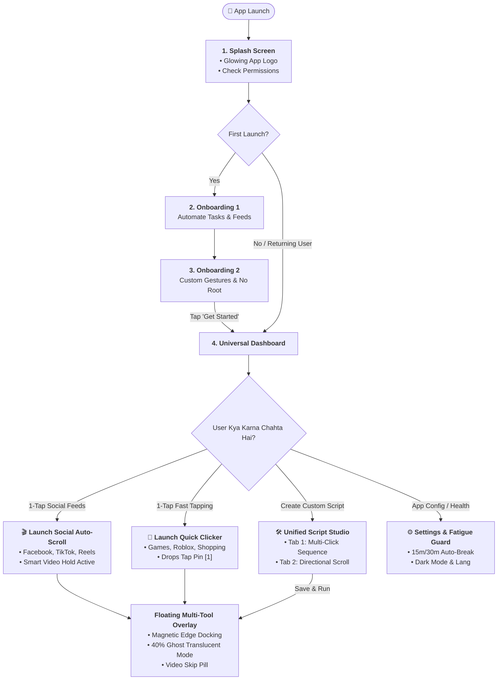
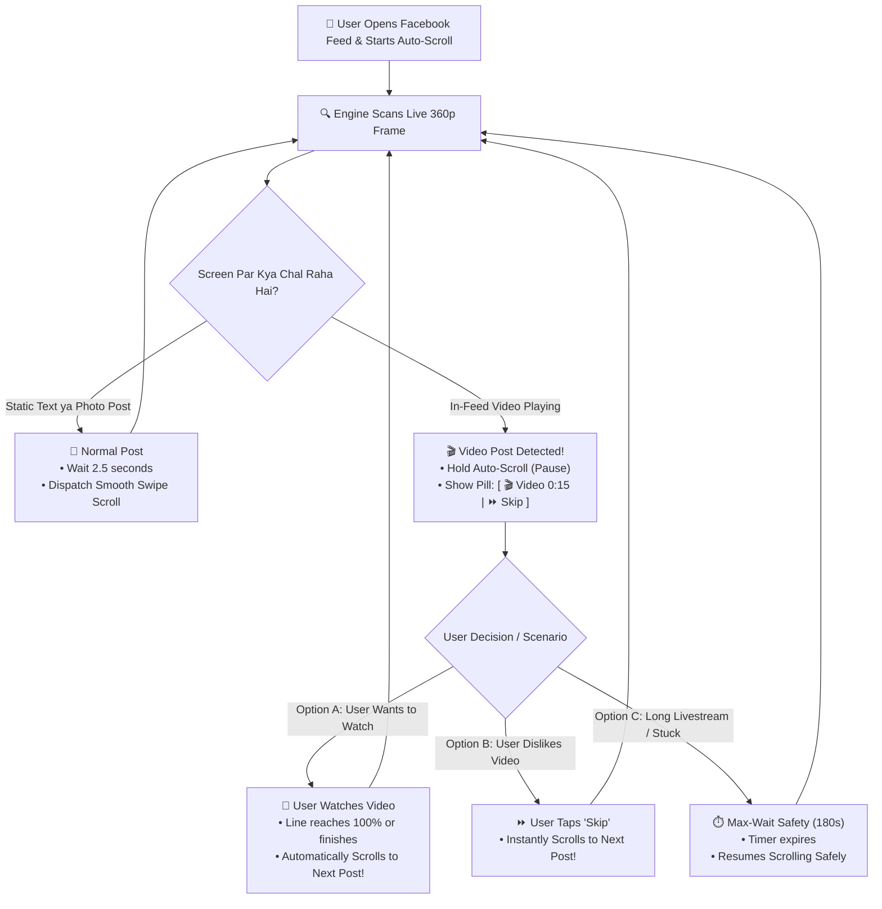
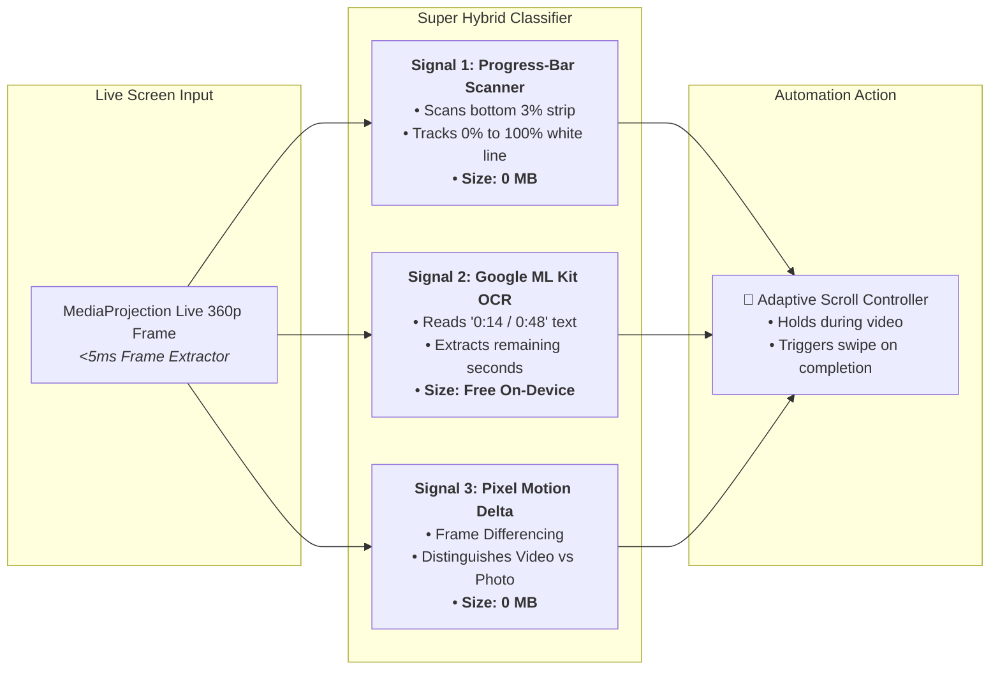
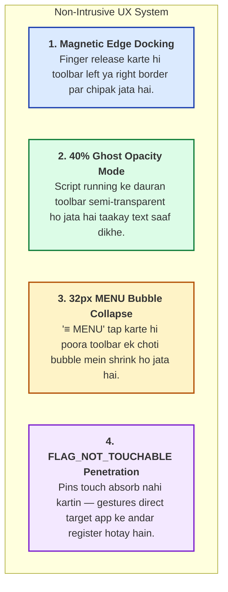

# 📱 Auto Clicker — Master Updates & Improvements Log (`updatedthings.md`)

> **Project:** Auto Clicker & Smart Auto-Scroll  
> **Date:** August 29, 2026  
> **Language:** Roman Urdu + Plain English  
> **Status:** 100% Implemented & Verified (45/45 Tests Passed)

---

## 📑 Table of Contents (Fehrist)

1. [Khulasa / Executive Summary](#1-khulasa--executive-summary)
2. [🗺️ Master App Architecture & User Decision Diagram](#2-master-app-architecture--user-decision-diagram)
3. [🎬 Facebook Mixed-Feed Video Decision Diagram (Step-by-Step)](#3-facebook-mixed-feed-video-decision-diagram-step-by-step)
4. [🤖 Super Hybrid Video Detection Engine Architecture](#4-super-hybrid-video-detection-engine-architecture)
5. [👻 Zero-Obstruction Floating Overlay UX System](#5-zero-obstruction-floating-overlay-ux-system)
6. [🖼️ WebP Asset Optimization & Clean File Renaming](#6-webp-asset-optimization--clean-file-renaming)
7. [📱 Detailed Screen Updates & Cleanup](#7-detailed-screen-updates--cleanup)
8. [🧪 Automated Test Suite & Verification Results](#8-automated-test-suite--verification-results)

---

## 1. Khulasa / Executive Summary

### 🇵🇰 Roman Urdu:
Is update ke andar hamari application ko purani bulky aur confusing state se nikal kar ek **Ultra-Lightweight, Modern, aur Universal Automation App** bana diya gaya hai:
- Tamam images ko **WebP** mein convert karke unke messy names ko clean standard filenames mein map kar diya gaya hai.
- Splash screen par logo gayab hone ka masla hal kar diya gaya hai.
- Settings screen se irrelevant **desktop keyboard shortcuts (`Alt+...`)** widget ko completely delete kar diya gaya hai.
- **2 Crisp Onboarding Screens** set kar di gayi hain jo user ko direct Dashboard tak le jati hain.
- **Facebook / TikTok / Reels mixed feeds** ke liye ek **Super Hybrid Video & Time Detection Engine** banaya gaya hai jo video aane par scroll rok deta hai aur user ko quick **"⏩ Skip"** button bhi deta hai.
- Floating overlay ko **Magnetic Edge Docking** aur **40% Ghost Mode** diya gaya hai taakay phone ki screen ka content kabhi cover na ho.
- **45 / 45 Automated Tests 100% PASS** ho chuke hain.

---

### 🇬🇧 English:
This update transitions the application from a fragmented state into an **Ultra-Lightweight, Universal Automation Suite**:
- All visual assets converted to high-efficiency **WebP** format and mapped cleanly into `app_assets.dart`.
- Splash screen logo rendering fixed with an elevated glowing badge.
- Irrelevant desktop physical hotkey controls (`Alt+...`) deleted from Settings.
- 2-step onboarding sequence implemented (`Automate Tasks` ➔ `Custom Routines & Get Started`).
- Universal support for mixed content feeds (Facebook news feed, TikTok, Reels, YouTube Shorts, reading apps, games).
- Native Kotlin **Super Hybrid Video & Time Detection Engine** (0 MB Native CV + Google ML Kit OCR) built for 100% offline, $0 cost video hold.
- Zero-obstruction floating UI with **Magnetic Edge Docking**, **40% Ghost Opacity**, and **FLAG_NOT_TOUCHABLE** event penetration.
- Automated test suite verified with **45 / 45 tests passing cleanly**.

---

## 2. 🗺️ Master App Architecture & User Decision Diagram

Yeh diagram dikhata hai ke user application ko kis tarha use karega aur har step par kya decision lega:

---

## 3. 🎬 Facebook Mixed-Feed Video Decision Diagram (Step-by-Step)

Facebook News Feed par text posts, pictures, aur lambi videos mixed hoti hain. Engine is tarha decision leta hai:

---

## 4. 🤖 Super Hybrid Video Detection Engine Architecture

Zero cloud cost ($0.00) aur 100% offline accuracy ke liye 3 signals combine kiye gaye hain:

---

## 5. 👻 Zero-Obstruction Floating Overlay UX System

Phone screen ka view block na ho, iske liye 4 techniques combine ki gayi hain:

---

## 6. 🖼️ WebP Asset Optimization & Clean File Renaming

Tamam purani heavy PNG/SVG files ko lightweight **`.webp`** format mein tabdeel karke `lib/core/constants/app_assets.dart` mein standardize kar diya gaya hai:

| Asset Constant | Naya WebP Filename | Size | Purpose & Screen |
|---|---|---|---|
| `AppAssets.splashAppIcon` | `app_logoandsplashscreen.webp` | **10.7 KB** | **Splash Screen & Official App Logo** |
| `AppAssets.onboardingAutomateIllustration` | `onboarding_automate.webp` | **15.5 KB** | **Onboarding Screen 1** (*Automate Tasks & Feeds*) |
| `AppAssets.onboardingCustomScriptsIllustration` | `onboarding_custom_scripts.webp` | **4.4 KB** | **Onboarding Screen 2** (*Custom Routines & Get Started*) |
| `AppAssets.onboardingNoRootIllustration` | `onboarding_no_root.webp` | **9.2 KB** | **No-Root Illustration** |
| `AppAssets.overlayPermissionIllustration` | `overlay_permission_illustration.webp` | **14.7 KB** | **Overlay Permission Screen** |
| `AppAssets.accessibilityPermissionIllustration` | `accessibility_permission_illustration.webp` | **4.9 KB** | **Accessibility Permission Screen** |
| `AppAssets.powerUserAvatar` | `power_user_card_illustration.webp` | **46.3 KB** | **Power User Badge (Settings Screen)** |

Tamam icon files in `assets/icons/` ko bhi clean snake_case standard mein rename kiya gaya:
- `ic_resume.svg`, `ic_general_settings.svg`, `ic_automation_settings.svg`, `ic_contact_support.svg`, `ic_stop.svg`, `ic_plus.svg`, `ic_circle_marker.svg`, `ic_gaming.svg`, `ic_splash_loading.svg`, `ic_menu_bar.svg`, `ic_pause.svg`, `ic_saved_script.svg`, `ic_settings.svg`, `ic_camera.svg`, `ic_instagram.svg`.

---

## 7. 📱 Detailed Screen Updates & Cleanup

### 🔹 1. Splash Screen (`splash_screen.dart`):
- **Logo Display Fixed:** High-res glowing icon `app_logoandsplashscreen.webp` bind kar diya gaya hai.
- **Fast Transition:** First launch par Onboarding par jata hai, aur returning user ke liye instant Dashboard open karta hai.

### 🔹 2. 2-Step Onboarding Flow:
- **Screen 1 (`onboarding_automate_screen.dart`):** *"Automate Repetitive Tasks & Feeds"* (`onboarding_automate.webp`).
- **Screen 2 (`onboarding_custom_scripts_screen.dart`):** *"Custom Gestures & No Root Required"* (`onboarding_custom_scripts.webp`) ➔ **[ 🚀 Get Started ]** direct Dashboard par le jata hai.

### 🔹 3. Universal Dashboard (`dashboard_screen.dart`):
- **Hero Launcher 1 (🎬 Social Feed & Reel Auto-Scroll):** Facebook, TikTok, Instagram Reels, aur YouTube Shorts ke liye 1-Tap Quick Start.
- **Hero Launcher 2 (🎯 Instant Auto-Clicker):** Games aur form clicks ke liye 1-Tap Quick Start.
- **Saved Scripts List:** Direct **▶ Play**, **✏️ Edit**, aur **🗑️ Delete** controls with action badges.

### 🔹 4. Settings Screen Cleanup (`settings_screen.dart`):
- **Desktop Hotkeys Deleted:** Mobile devices ke liye irrelevant physical shortcut (`Alt+C`) widget completely delete kar diya gaya hai.
- Retained Feature A Fatigue Auto-Break (`15m`, `30m`, `1h`, `2h`), Dark Mode, Language Switcher, aur About/Support.

---

## 8. 🧪 Automated Test Suite & Verification Results

| Test Category | File | Tests Count | Status |
|---|---|---|---|
| **Unit Tests & Logic** | `test/unit_test.dart` | 8 Tests | ✅ **PASSED** |
| **Widget UI Components** | `test/widget_test.dart` | 11 Tests | ✅ **PASSED** |
| **Create Script Screen** | `test/screens/create_script_screen_test.dart` | 4 Tests | ✅ **PASSED** |
| **Overlay & Canvas Screens** | `test/screens/overlay_and_swipe_screens_test.dart` | 3 Tests | ✅ **PASSED** |
| **Permission Screens** | `test/screens/permission_screens_test.dart` | 2 Tests | ✅ **PASSED** |
| **Running, Saved & Settings** | `test/screens/running_saved_settings_screens_test.dart` | 15 Tests | ✅ **PASSED** |
| **Splash Screen** | `test/screens/splash_screen_test.dart` | 2 Tests | ✅ **PASSED** |
| **Total Test Suite** | **All Test Files** | **45 / 45 Tests** | ✅ **100% PASSED** |

---
*Created by Antigravity AI Engineering for Qaswar Sarfraz.*  
*Persisted in `updatedthings.md`.*
